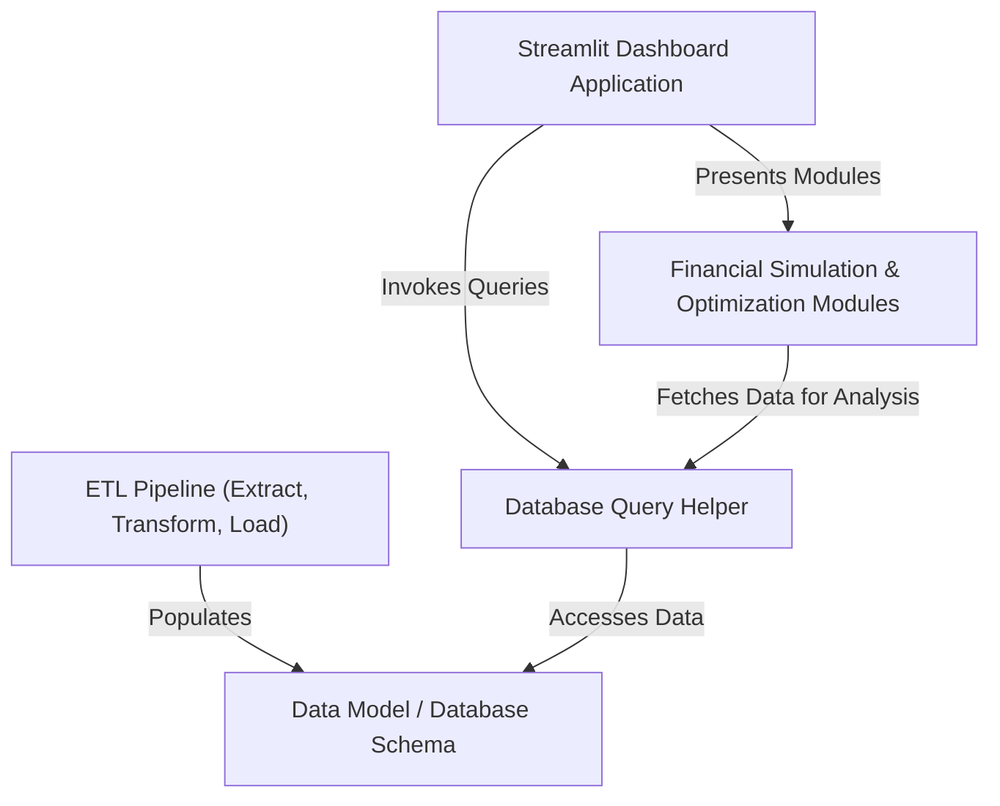
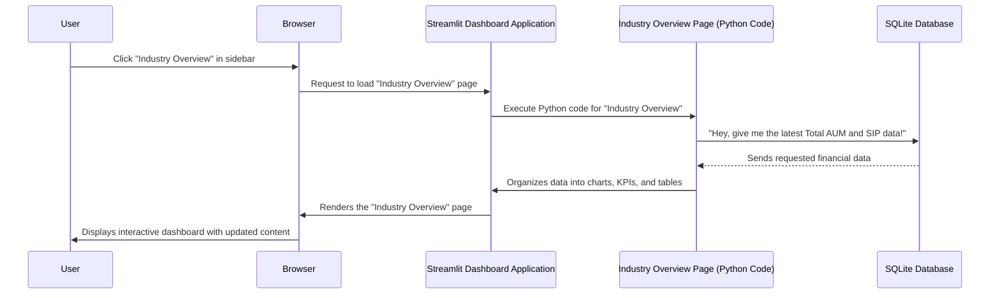
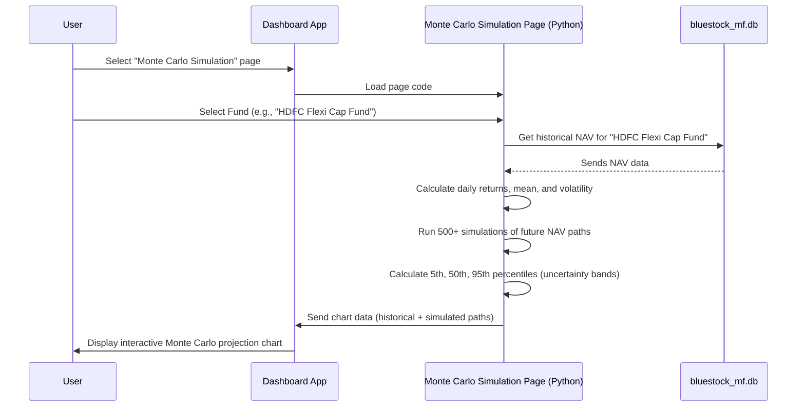
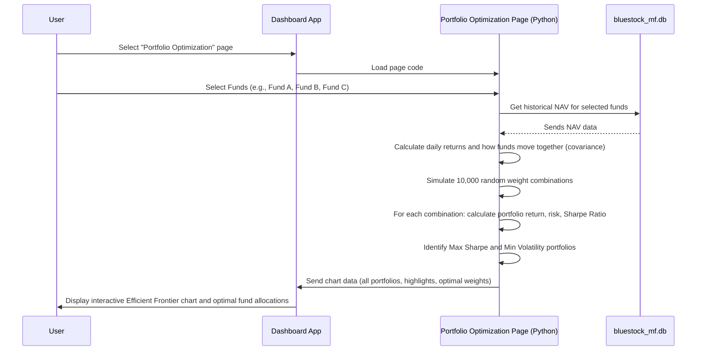
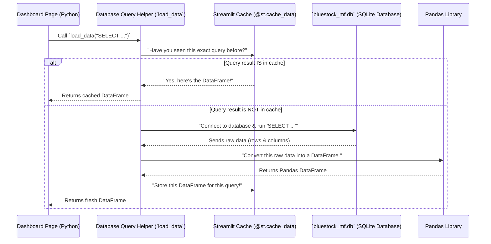
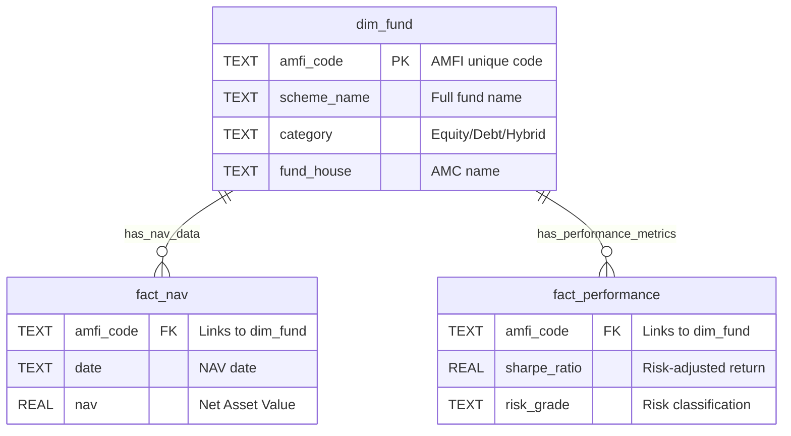
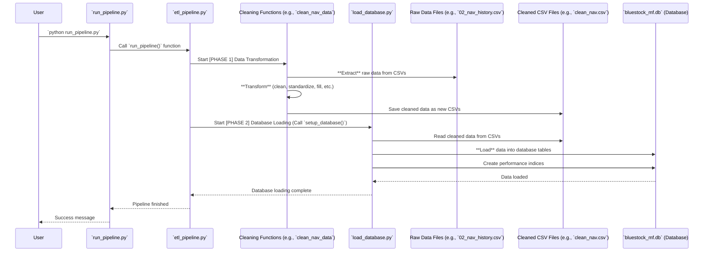

# Bluestock_mf_capstone

<div align="center">

[](https://bluestockcapstone-m6s4cfulhnzwt5fssvmjhh.streamlit.app/)


</div>


This project, Bluestock Mutual Fund Analytics, offers an _interactive web dashboard_ built with Streamlit for exploring mutual fund data. It features an automated **ETL pipeline** to collect, clean, and load financial data into a structured _SQLite database_. Users can visualize fund performance, industry trends, and investor demographics, along with advanced **financial simulations** like Monte Carlo projections and Markowitz portfolio optimization to make informed investment decisions.



## Chapters

## Chapters

1. [Streamlit Dashboard Application](#chapter-1-streamlit-dashboard-application)
2. [Financial Simulation & Optimization Modules](#chapter-2-financial-simulation--optimization-modules)
3. [Database Query Helper](#chapter-3-database-query-helper)
4. [Data Model / Database Schema](#chapter-4-data-model--database-schema)
5. [ETL Pipeline (Extract, Transform, Load)](#chapter-5-etl-pipeline-extract-transform-load)

---

# Chapter 1: Streamlit Dashboard Application

Imagine you have a huge pile of mutual fund data – a mountain of numbers, names, and dates. How do you make sense of it all? How do you easily spot trends, compare different funds, or understand investor behavior without needing to write complex code every single time you have a question?

This is exactly the problem our **Streamlit Dashboard Application** solves! It's like having your own personal financial research assistant, always ready to show you valuable insights with just a few clicks. Think of it as a customizable control panel for your mutual fund data.

### What is a Streamlit Dashboard Application?

Let's break down this concept into simple pieces:

1.  **Streamlit: The Magic Tool**: Streamlit is a fantastic Python library that allows us to build interactive web applications (like our dashboard) using _just Python code_. You don't need to be a web development expert; if you can write Python, you can build a Streamlit app! It lets us "draw" charts, tables, and buttons directly with Python commands.

2.  **The Dashboard Application**: This refers to the entire interactive website you see. It's designed to be a "control panel" where users can explore mutual fund data, apply filters, and visualize trends without writing any code. It's the "user's window into the analytics."

3.  **Pages & Sidebar**: Just like a book has chapters, our dashboard has different "pages" for different topics. For example, one page might be for a general "Industry Overview," and another for "Fund Performance" of individual funds. You navigate between these pages using a menu, typically located on the left side of the dashboard – this is called the **sidebar**.

4.  **Charts, Tables, KPIs, and Filters (Widgets)**: These are the interactive elements you'll find on the pages.
    - **Charts** (like line graphs or bar charts) help visualize trends.
    - **Tables** display detailed data in an organized way.
    - **KPIs** (Key Performance Indicators) are those big, important numbers that highlight crucial metrics (e.g., "Total AUM").
    - **Filters** (like dropdown menus or checkboxes) let you customize what data you want to see. For example, you might filter funds by "Equity" category or by a specific "Fund House."

### How Do You Use It?

Using the Streamlit Dashboard Application is straightforward and doesn't require any coding from your side!

1.  **Start the Application**: Typically, you (or someone who set it up) would run a simple Python command in your terminal:

    ```bash
    streamlit run dashboard/app.py
    ```

    This command tells your computer to start the Streamlit application.

2.  **Open in Browser**: After running the command, a new tab will automatically open in your web browser, showing the dashboard's main welcome page.

3.  **Explore with the Sidebar**: On the left side of the dashboard, you'll see a sidebar menu. You can click on different page names, such as:
    - "Industry Overview" to see macro-level trends.
    - "Fund Performance" to deep-dive into specific funds.
    - "Investor Analytics" to understand transaction patterns.
    - And more!

4.  **Interact with Filters and Charts**: Once on a page, you can use the dropdowns, checkboxes, or sliders (our "filters") to narrow down the data you're interested in. The charts and tables will instantly update to reflect your selections, allowing you to explore the data dynamically.

### What Happens "Under the Hood" When You Click?

Let's imagine you click on the "Industry Overview" page in the sidebar. Here's a simplified sequence of events:



In essence:

1.  You (the **User**) click a page name.
2.  Your web browser tells the **Streamlit Dashboard Application** to load that specific page.
3.  The Python code for that page (like `1_Industry_Overview.py`) starts running.
4.  This code then asks our **SQLite Database** for the specific mutual fund data it needs (e.g., latest AUM, SIP inflows). We'll learn more about how we talk to the database in the [Database Query Helper](#chapter-3-database-query-helper) chapter and what data it holds in [Data Model / Database Schema](#chapter-4-data-model--database-schema).
5.  The database sends the data back.
6.  The Python code uses this data to create interactive charts (using libraries like `plotly`) and formats numbers for Key Performance Indicators (KPIs).
7.  Finally, Streamlit takes all these components and displays them beautifully in your **Browser** for you to see and interact with!

### A Peek at the Code

Let's look at some very simple code snippets to see how Streamlit works its magic.

**The Main Entry Point: `app.py`**

The `app.py` file (located in `dashboard/app.py`) is like the welcome mat to our application. When you run `streamlit run`, this is the first file Streamlit looks at.

```python
# File: dashboard\app.py
import streamlit as st # Import the Streamlit library
import os

# Configure how your web page looks
st.set_page_config(
    page_title="Bluestock MF Dashboard", # Title in browser tab
    page_icon="📈",                      # Icon in browser tab
    layout="wide",                       # Use the full width of the screen
    initial_sidebar_state="expanded"     # Keep the sidebar open by default
)

# ... (code to load and display a logo, not shown here to keep it simple) ...

# Display a main title and a welcome message
st.title("📈 Bluestock Mutual Fund Analytics")
st.markdown("""
Welcome to the interactive mutual fund dashboard!

This dashboard connects directly to the live SQLite database (`bluestock_mf.db`) to provide real-time analytics.
Please select a page from the sidebar menu to explore different analytics:

*   **1. Industry Overview:** Macro-level KPIs and AUM trends.
*   **2. Fund Performance:** Deep-dive into specific mutual funds and risk metrics.
*   # ... (other pages are listed here) ...
""")
```

- `import streamlit as st`: This line is essential! It imports the Streamlit library, allowing us to use its functions by typing `st.something()`.
- `st.set_page_config(...)`: This sets up basic properties for our web page, like the title you see in your browser tab (`page_title`), a little emoji icon (`page_icon`), and how wide the content can be (`layout="wide"`).
- `st.title(...)` and `st.markdown(...)`: These functions are how we place text on our dashboard. `st.title` makes large, bold text, and `st.markdown` lets us write text using Markdown formatting (like bullet points or bold words). This is what creates the friendly welcome message you see when you first open the app.

**Building a Page: `1_Industry_Overview.py`**

Each distinct "page" in our dashboard is a separate Python file, typically found inside the `dashboard/pages` folder. Let's look at `dashboard/pages/1_Industry_Overview.py` as an example to see how a page is constructed.

```python
# File: dashboard\pages\1_Industry_Overview.py
import streamlit as st # For dashboard elements
import pandas as pd    # For data manipulation
import sqlite3         # For connecting to the database
import plotly.express as px # For creating charts

st.set_page_config(page_title="Industry Overview", layout="wide")

# ... (logo loading code and database path setup) ...

@st.cache_data # This makes data loading super fast!
def load_data(query):
    """Executes a SQL query and returns a pandas DataFrame."""
    try:
        conn = sqlite3.connect(DB_PATH) # Connects to our SQLite database
        df = pd.read_sql(query, conn)  # Runs the SQL query and gets data
        conn.close()
        return df
    except Exception as e:
        st.error(f"Database error: {e}") # Shows an error if something goes wrong
        return pd.DataFrame()

st.title("🏢 Industry Overview")
st.markdown("Macro-level snapshot of the Indian Mutual Fund Industry.")

# --- 1. FETCH KPI DATA ---
# This is a SQL query to get the total Asset Under Management (AUM)
aum_query = """
SELECT SUM(aum_lakh_crore) as total_aum
FROM fact_aum
WHERE date = (SELECT MAX(date) FROM fact_aum)
"""
total_aum_df = load_data(aum_query) # Call our function to get data from the DB
total_aum = total_aum_df.iloc[0]['total_aum'] if not total_aum_df.empty else 0

# --- 2. RENDER KPI CARDS ---
col1, col2, col3, col4 = st.columns(4) # Create 4 columns to arrange content side-by-side
col1.metric("Total AUM", f"Rs. {total_aum:.2f}L Cr") # Display a big, bold metric
# ... (other metrics are displayed in col2, col3, col4) ...

st.markdown("---") # Draws a horizontal separator line

# --- 3. RENDER CHARTS ---
col_left, col_right = st.columns(2) # Create 2 columns for side-by-side charts

with col_left:
    st.subheader("Industry AUM Growth")
    aum_trend_query = "SELECT date, SUM(aum_lakh_crore) as total_aum FROM fact_aum GROUP BY date ORDER BY date"
    aum_trend_df = load_data(aum_trend_query)

    if not aum_trend_df.empty:
        fig_aum = px.line(aum_trend_df, x='date', y='total_aum', markers=True,
                          title="Total Industry AUM (Lakh Crore) - 2022 to 2025")
        st.plotly_chart(fig_aum, use_container_width=True) # Display the interactive line chart
    # ... (rest of the page logic and the second chart in col_right) ...
```

- `@st.cache_data`: This is a performance optimization. It tells Streamlit to remember the result of the `load_data` function. If you call `load_data` with the exact same query again, Streamlit will just give you the saved result instead of re-running the query, making your dashboard much faster!
- `load_data(query)`: This custom Python function is our crucial link to the database. It takes a SQL query (a command to ask the database for specific information), connects to our `bluestock_mf.db` database, runs the query, and brings the data back as a `pandas DataFrame` (a table-like structure in Python).
- `st.columns(...)`: This is a powerful layout tool. It allows us to arrange content (like our KPI cards or charts) next to each other, making the dashboard look neat and organized.
- `st.metric(...)`: This function is perfect for displaying Key Performance Indicators (KPIs) – those big, important numbers like "Total AUM."
- `plotly.express as px`: This library is used to create beautiful, interactive charts. `px.line` makes a line chart, and `px.bar` makes a bar chart.
- `st.plotly_chart(...)`: Once we create a chart using `plotly`, this function displays it on our Streamlit dashboard, making it interactive for users.

In essence, the Python code for each page retrieves data from the database, processes it (if needed), and then uses various Streamlit functions (`st.title`, `st.markdown`, `st.columns`, `st.metric`, `st.plotly_chart`) to build the visual and interactive elements of the dashboard.

### Conclusion

In this chapter, we learned that the **Streamlit Dashboard Application** is an interactive web interface that allows users to easily explore and visualize mutual fund data without writing any code. We understood how it's built with Python using the Streamlit library, how it uses different "pages" for various topics, and how it fetches data from a database to display charts, tables, and important numbers.

Next, we'll dive deeper into the core financial calculations and models that power some of these insights in our dashboard: the [Financial Simulation & Optimization Modules](#chapter-2-financial-simulation--optimization-modules).

---

# Chapter 2: Financial Simulation & Optimization Modules

In the previous chapter, [Streamlit Dashboard Application](#chapter-1-streamlit-dashboard-application), we learned how our dashboard provides a user-friendly window into mutual fund data, allowing you to see trends and numbers with just a few clicks. But what if you don't just want to see what _has happened_, but also want to understand what _could happen_ in the future, or how to make the _best decisions_ with your funds?

This is where our **Financial Simulation & Optimization Modules** come in! Think of them as the "brain" behind the dashboard that performs smart calculations. They don't just show you raw data; they help you forecast, strategize, and make smarter investment choices.

### What Problem Do These Modules Solve?

Imagine you're trying to build a portfolio of mutual funds. You have some historical data, but:

1.  **How do you predict how a fund might perform in the _future_?** The past is not always a perfect guide.
2.  **How do you choose a _combination_ of funds that gives you the best return without taking on too much risk?** Just picking the highest-return fund might also mean picking the riskiest one!
3.  **How do you get personalized fund suggestions based on _your_ comfort level with risk?**

These modules provide powerful, data-driven answers to these tough questions!

Let's break down these "smart calculations" into three key concepts:

1.  **Monte Carlo Simulation:** For forecasting future fund values.
2.  **Markowitz Portfolio Optimization:** For finding the best combination of funds.
3.  **Fund Recommender:** For suggesting funds based on your risk appetite.

---

### 1. Monte Carlo Simulation: Predicting the Future with "What If" Scenarios

Have you ever wondered, "What if the market does really well?" or "What if it has a rough patch?" The Monte Carlo Simulation helps answer these "what if" questions for your mutual fund's Net Asset Value (NAV) by simulating thousands of possible futures.

**Analogy:** Imagine you're rolling a special, weighted dice that represents a fund's daily performance. Instead of rolling it once, you roll it 1,000 times, then 1,000 more times, each time recording the outcome for many days into the future. By looking at all these thousands of simulated paths, you can get a good idea of the best, worst, and most likely scenarios.

**What it does:**
It forecasts a fund's future value (NAV) by:

- Looking at its past daily ups and downs (historical volatility).
- Randomly generating thousands of possible future daily ups and downs based on those historical patterns.
- Creating thousands of potential "paths" the fund's NAV could take over a period (e.g., 5 years).
- Showing you the range of potential outcomes, from the optimistic ("best case") to the pessimistic ("worst case"), and the most probable ("expected").

#### How to Use It (on the Dashboard):

On the Streamlit dashboard, you'd simply navigate to the "Monte Carlo Simulation" page. You'd then select a mutual fund from a dropdown menu. The dashboard would then display a chart showing its historical NAV and the projected future NAV with "uncertainty bands" for the best, worst, and expected outcomes.



#### Under the Hood: The Simulation Steps

The Monte Carlo simulation page (`dashboard\pages\5_Monte_Carlo_Simulation.py`) performs these steps:

1.  **Get Historical Data:** It first fetches all past daily NAVs for your chosen fund from our [Data Model / Database Schema](#chapter-4-data-model--database-schema) using the [Database Query Helper](#chapter-3-database-query-helper).

    ```python
    # From dashboard\pages\5_Monte_Carlo_Simulation.py
    # Fetch historical NAV for the selected fund
    nav_query = f"SELECT date, nav FROM fact_nav WHERE amfi_code = '{amfi_code}' ORDER BY date ASC"
    nav_df = load_data(nav_query) # load_data talks to the database
    ```

    _Explanation:_ This code queries our database to get the `date` and `nav` (Net Asset Value) for the fund you selected. The `load_data` function (which we saw in Chapter 1) handles the actual database connection.

2.  **Calculate Key Statistics:** From these historical NAVs, it calculates the average daily return (`mu`) and how much the daily returns typically spread out (`sigma`, also known as volatility).

    ```python
    # From dashboard\pages\5_Monte_Carlo_Simulation.py
    nav_df['daily_return'] = nav_df['nav'].pct_change().clip(lower=-0.03, upper=0.03)
    mu = nav_df['daily_return'].mean()   # Average daily return
    sigma = nav_df['daily_return'].std() # Daily volatility (risk)
    ```

    _Explanation:_ We calculate the percentage change day-over-day to get daily returns. We also "clip" them to make sure extreme, unrealistic jumps in data don't mess up our simulation. `mu` gives us the average tiny step the fund takes each day, and `sigma` tells us how big those steps usually are.

3.  **Run Thousands of Simulations:** Using `mu` and `sigma`, the module then simulates daily returns for many future days, repeated for hundreds or thousands of "parallel universes" (simulations). Each new day's NAV is calculated from the previous day's NAV and a randomly generated daily return.

    ```python
    # From dashboard\pages\5_Monte_Carlo_Simulation.py (simplified)
    NUM_SIMULATIONS = 500
    TIME_HORIZON = 5 * 252 # 5 years of trading days

    # Generate random daily returns for all simulations
    simulated_daily_returns = np.random.normal(mu, sigma, (TIME_HORIZON, NUM_SIMULATIONS))

    # Calculate price paths for all simulations
    price_paths = np.zeros_like(simulated_daily_returns)
    price_paths[0] = latest_nav * (1 + simulated_daily_returns[0]) # First day
    for t in range(1, TIME_HORIZON):
        price_paths[t] = price_paths[t-1] * (1 + simulated_daily_returns[t])
    ```

    _Explanation:_ `np.random.normal` generates random numbers (representing daily returns) that follow the historical pattern (mean `mu`, standard deviation `sigma`). We then step through each day, multiplying the previous day's NAV by `(1 + random_daily_return)` to get the new NAV, repeating this for all 500 simulations.

4.  **Visualize Uncertainty:** Finally, it takes all these simulated paths and calculates "percentiles" for each future date. The 5th percentile shows the "worst case" (only 5% of simulations were worse), the 50th percentile shows the "expected case" (median), and the 95th percentile shows the "best case." These are plotted on the dashboard.

    ```python
    # From dashboard\pages\5_Monte_Carlo_Simulation.py (simplified)
    p5 = np.percentile(price_paths, 5, axis=1)   # 5th percentile (Worst Case)
    p50 = np.percentile(price_paths, 50, axis=1) # 50th percentile (Median/Expected)
    p95 = np.percentile(price_paths, 95, axis=1) # 95th percentile (Best Case)

    # Use plotly to plot fig.add_trace for historical, p5, p50, p95
    # st.plotly_chart(fig, use_container_width=True)
    ```

    _Explanation:_ We use `np.percentile` to find these key levels across all the simulated paths for each future day. Then, the `plotly` library (which we briefly saw in Chapter 1) is used to draw the beautiful, interactive chart on the dashboard.

---

### 2. Markowitz Portfolio Optimization: Finding the "Efficient Frontier"

Choosing just one fund is hard enough, but choosing a _mix_ of funds is even harder! How do you combine them so that you get the highest possible return without taking on unnecessary risk? This is what Markowitz Portfolio Optimization helps you with.

**Analogy:** Imagine you're a chef trying to make the tastiest, healthiest meal possible with a limited set of ingredients. Each ingredient (fund) has a certain flavor (return) and some might be a bit risky (volatility). Some ingredients might also work really well together, enhancing each other, while others might clash. The Markowitz algorithm helps you find the _perfect recipe_ (portfolio weights) that gives you the best "taste-to-health" ratio (return-to-risk ratio).

**What it does:**

- Allows you to select several mutual funds.
- Calculates their historical returns and, importantly, how their prices move _together_ (this is called covariance).
- Simulates thousands of different ways to combine these funds (e.g., 20% in Fund A, 30% in Fund B, 50% in Fund C, or 10% in A, 80% in B, 10% in C, etc.).
- For each combination, it calculates the portfolio's overall expected return and its overall risk (volatility).
- It then plots these combinations on a graph, showing you the "Efficient Frontier" – a line representing the portfolios that give the maximum possible return for each level of risk. You can then pick a portfolio on this line that matches your risk comfort. The "Maximum Sharpe Ratio" portfolio is often highlighted as the "best" mathematically, as it offers the highest return per unit of risk.

#### How to Use It (on the Dashboard):

On the Streamlit dashboard, you would go to the "Portfolio Optimization" page. You'd use a multi-select box to choose, say, 2 to 5 mutual funds. The dashboard would then display a scatter plot showing thousands of possible portfolio combinations (the "Efficient Frontier") and highlight the two most important: the one with the highest "Sharpe Ratio" (best return for risk) and the one with the "Minimum Volatility" (least risky). It also shows you the optimal percentage allocation for each fund in the "best" portfolio.



#### Under the Hood: Optimizing Your Portfolio

The Portfolio Optimization page (`dashboard\pages\6_Portfolio_Optimization.py`) handles this process:

1.  **Fetch and Prepare Data:** It gets historical NAV data for all selected funds and converts it into daily returns. Importantly, it needs to understand how funds move _together_ using a "covariance matrix."

    ```python
    # From dashboard\pages\6_Portfolio_Optimization.py (simplified)
    # Get NAV for selected funds
    raw_df = pd.read_sql(query, conn, params=selected_amfi_codes)
    nav_pivot = raw_df.pivot(index='date', columns='amfi_code', values='nav')
    nav_pivot = nav_pivot.resample('B').ffill().dropna() # Align dates
    returns_df = nav_pivot.pct_change().dropna() # Daily returns

    # Calculate Annualized Returns and Covariance Matrix
    TRADING_DAYS = 252
    mean_returns = returns_df.mean() * TRADING_DAYS
    cov_matrix = returns_df.cov() * TRADING_DAYS
    ```

    _Explanation:_ We fetch NAVs for all chosen funds, make sure their dates align, and calculate their daily returns. `mean_returns` gives the average return for each fund, and `cov_matrix` shows how much their returns move in sync (or opposite directions). This `cov_matrix` is crucial for understanding portfolio risk.

2.  **Run Portfolio Simulations:** It then creates thousands of random ways to split your investment across the chosen funds (these are called "weights"). For each combination, it calculates the overall portfolio's expected return and its overall risk (volatility) using advanced math involving `mean_returns` and `cov_matrix`.

    ```python
    # From dashboard\pages\6_Portfolio_Optimization.py (simplified)
    NUM_PORTFOLIOS = 10000
    num_funds = len(selected_funds)

    # Generate random weights for each fund (summing to 1 for each portfolio)
    weights = np.random.dirichlet(np.ones(num_funds), size=NUM_PORTFOLIOS)

    # Calculate portfolio returns and volatility for each simulated portfolio
    port_returns = np.dot(weights, mean_returns)
    port_volatility = np.zeros(NUM_PORTFOLIOS)
    for i in range(NUM_PORTFOLIOS):
        port_volatility[i] = np.sqrt(np.dot(weights[i].T, np.dot(cov_matrix, weights[i])))

    # Calculate Sharpe Ratio (Return / Risk)
    sharpe_ratios = (port_returns - RISK_FREE_RATE) / port_volatility
    ```

    _Explanation:_ `np.random.dirichlet` creates sets of weights (percentages) for our funds that always add up to 100%. Then, for each of the 10,000 simulated portfolios, we calculate its total expected return and total risk using the `weights`, `mean_returns`, and `cov_matrix`. The Sharpe Ratio tells us how good the return is _compared to_ the risk taken.

3.  **Identify Optimal Portfolios and Visualize:** The results (returns, risks, and Sharpe Ratios for all 10,000 portfolios) are then plotted on a graph, creating the "Efficient Frontier." The algorithm identifies the portfolio with the highest Sharpe Ratio (best risk-adjusted return) and the one with the lowest volatility (least risk) and highlights them.

    ```python
    # From dashboard\pages\6_Portfolio_Optimization.py (simplified)
    # Find the portfolio with the highest Sharpe Ratio and lowest Volatility
    max_sharpe_idx = port_results['Sharpe'].idxmax()
    min_vol_idx = port_results['Volatility'].idxmin()

    # Use plotly to plot the scatter plot of all portfolios, plus highlights
    # fig.add_trace(go.Scatter(...))
    # st.plotly_chart(fig, use_container_width=True)
    ```

    _Explanation:_ `idxmax()` and `idxmin()` quickly find the "best" portfolios from our simulated results. `plotly` then helps us draw the graph and mark these important points clearly for the user.

---

### 3. Fund Recommender: Personalized Fund Suggestions

If you're unsure which fund categories to even begin with, a fund recommender can be super helpful. It acts like a quick filter, suggesting funds that align with your general comfort level for risk.

**Analogy:** Imagine asking a store clerk, "I like adventure novels, what do you suggest?" The clerk doesn't need to know every single book you've read, just your preference (adventure), and they'll suggest some top-rated adventure books.

**What it does:**

- You tell it your general **risk appetite** (e.g., "Low," "Moderate," or "High").
- It looks through all available funds.
- It filters them based on their inherent risk level and then sorts them by a performance metric like the **Sharpe Ratio** (which we just discussed – higher is better).
- It suggests a few top funds that match your criteria.

#### How to Use It (Behind the Scenes / Could be a Dashboard Feature):

While not explicitly a separate page on the current dashboard, this module exists as a Python script (`scripts\recommender.py`) that could power a recommendation feature. You'd typically run this script (or it could be triggered by a button on a dashboard page) and input your risk preference.

```bash
python scripts/recommender.py
```

This script would then print out a table of recommended funds in your terminal.

#### Under the Hood: The Recommendation Logic

The fund recommender script (`scripts\recommender.py`) follows these steps:

1.  **Load Fund Data:** It loads a list of all mutual funds and their associated metrics, including a calculated Sharpe Ratio (which we covered in Portfolio Optimization!) and their risk grades.

    ```python
    # From scripts\recommender.py
    funds = pd.read_csv(data_dir / 'clean_fund_master.csv')
    sharpe = pd.read_csv(data_dir / 'sharpe_values.csv')
    df = pd.merge(funds, sharpe, on='amfi_code')
    ```

    _Explanation:_ It reads two CSV files. `clean_fund_master.csv` has basic fund details, and `sharpe_values.csv` contains the calculated Sharpe Ratios for each fund. These are joined together using the `amfi_code` (a unique fund identifier).

2.  **Determine Fund Risk:** It determines the risk level for each fund. This could be from a predefined `risk_grade` column in our database, or it can be _mapped_ based on the fund's `category` (e.g., Debt funds are generally 'Low' risk, Small Cap Equity funds are 'High' risk).

    ```python
    # From scripts\recommender.py (simplified)
    # Fallback mapping based on Category and Sub-category if no explicit risk_grade
    def map_risk(row):
        cat = str(row['category']).lower()
        if 'debt' in cat: return 'Low'
        elif 'equity' in cat:
            if 'large' in str(row['sub_category']).lower(): return 'Moderate'
            else: return 'High'
        return 'Moderate'
    df['mapped_risk'] = df.apply(map_risk, axis=1)
    risk_col = 'mapped_risk'
    ```

    _Explanation:_ This function `map_risk` assigns a "Low," "Moderate," or "High" risk label to each fund based on its type if a specific risk column isn't present in the data.

3.  **Filter and Sort:** It filters the entire list of funds to only include those matching your chosen risk appetite. Then, it sorts these matching funds by their Sharpe Ratio, placing the best performing (risk-adjusted) funds at the top.

    ```python
    # From scripts\recommender.py
    target_risk = risk_appetite.lower() # 'low', 'moderate', or 'high'
    filtered_df = df[df[risk_col].str.lower().str.contains(target_risk, na=False)]

    # Sort by Sharpe Ratio (highest is best) and pick top 3
    top_3 = filtered_df.sort_values(by=sharpe_col, ascending=False).head(3)
    ```

    _Explanation:_ `str.contains(target_risk)` helps find funds whose risk description matches (e.g., "Low to Moderate" for a "Low" search). Then, `sort_values` puts the funds with the highest `sharpe_col` at the top, and `.head(3)` selects the top three.

4.  **Display Recommendations:** Finally, it presents these top funds to you in an easy-to-read format.

    ```python
    # From scripts\recommender.py
    print(f"\n--- TOP 3 RECOMMENDED FUNDS ({risk_appetite.upper()} RISK) ---")
    output = top_3[['scheme_name', 'category', sharpe_col]].copy()
    output.rename(columns={'scheme_name': 'Fund Name', sharpe_col: 'Sharpe Ratio'}, inplace=True)
    print(output.to_string())
    ```

    _Explanation:_ This code simply formats the selected top funds and their details (like name, category, and Sharpe Ratio) into a clean table for display.

---

### Conclusion

In this chapter, we explored the powerful **Financial Simulation & Optimization Modules**. We learned how the **Monte Carlo Simulation** helps us forecast future fund values by running thousands of "what if" scenarios, how **Markowitz Portfolio Optimization** helps us find the "efficient frontier" – the best combination of funds for optimal risk-adjusted returns – and how a **Fund Recommender** can suggest suitable funds based on your risk appetite.

These modules transform raw historical data into actionable insights, helping users make more informed investment decisions. All these calculations rely heavily on having well-organized and accessible data. In our next chapter, we'll dive into how we actually get and manage this data with the [Database Query Helper](#chapter-3-database-query-helper).

---

# Chapter 3: Database Query Helper

In the last chapter, [Financial Simulation & Optimization Modules](#chapter-2-financial-simulation--optimization-modules), we saw how our dashboard can perform complex calculations like forecasting future NAVs and optimizing portfolios. But for all these powerful features and the beautiful charts we discussed in [Streamlit Dashboard Application](#chapter-1-streamlit-dashboard-application), there's one fundamental question: **Where does all the data come from?**

Imagine you have a giant filing cabinet filled with all the mutual fund information – historical prices, fund details, transaction records, and more. How do your dashboard pages reliably, quickly, and safely get the specific pieces of information they need from this filing cabinet? This is exactly the problem our **Database Query Helper** solves!

### What is the Database Query Helper?

The Database Query Helper is a special, reusable Python function named `load_data` that acts as the trusted messenger between our dashboard application and our central SQLite database. It's like having a dedicated librarian who knows exactly how to find the right book (data), present it neatly, and even remember frequently asked for information to save time.

Every time a dashboard page needs data – whether it's for displaying current AUM, plotting a fund's historical NAV, or running a simulation – it asks `load_data` to fetch it.

Let's break down its superpowers:

1.  **Secure Connection:** It knows how to connect to our SQLite database (`bluestock_mf.db`) safely.
2.  **Execute Queries:** You tell it _what_ data you want by giving it a special request called an **SQL Query**. It takes this request and runs it against the database.
3.  **Data Conversion:** The database usually sends raw data. `load_data` efficiently converts this raw data into a friendly **Pandas DataFrame** – which is like a neat table in Python, super easy for us to work with.
4.  **Close Connection:** Once it gets the data, it politely closes the connection to the database, ensuring everything is tidy and secure.
5.  **Smart Memory (Caching):** This is where the `@st.cache_data` magic comes in! If you ask for the _exact same data_ again, `load_data` remembers the answer from last time and gives it to you instantly, without bothering the database again. This makes our dashboard super fast!

### How to Use the Database Query Helper

You've actually already seen `load_data` in action in Chapter 1 when we looked at the `1_Industry_Overview.py` page! It's used to fetch all the Key Performance Indicators (KPIs) and chart data.

Let's revisit a simple example: getting the total Asset Under Management (AUM) for the industry.

**Your Goal:** Display the latest total AUM on the "Industry Overview" page.

**The Request (SQL Query):**
To get this data from our database, you'd write an SQL query like this:

```sql
SELECT SUM(aum_lakh_crore) as total_aum
FROM fact_aum
WHERE date = (SELECT MAX(date) FROM fact_aum)
```

- **`SELECT SUM(aum_lakh_crore) as total_aum`**: This part says, "Add up all the numbers in the `aum_lakh_crore` column and call the result `total_aum`."
- **`FROM fact_aum`**: This tells the database to look in the `fact_aum` table (which holds AUM data).
- **`WHERE date = (SELECT MAX(date) FROM fact_aum)`**: This is a filter! It makes sure we only get the AUM for the _most recent date_ available in the table.

**Using `load_data` in your Python code:**

Now, to get this data using our helper function, you just pass your SQL query string to `load_data`:

```python
# From dashboard\pages\1_Industry_Overview.py (simplified)

# The SQL query we want to run
aum_query = """
SELECT SUM(aum_lakh_crore) as total_aum
FROM fact_aum
WHERE date = (SELECT MAX(date) FROM fact_aum)
"""

# Call our helper function to get the data
total_aum_df = load_data(aum_query)

# Now, total_aum_df is a Pandas DataFrame with our AUM data!
# You can then extract the value:
total_aum = total_aum_df.iloc[0]['total_aum'] if not total_aum_df.empty else 0

st.metric("Total AUM", f"Rs. {total_aum:.2f}L Cr") # Display on dashboard
```

- `aum_query`: This is just a Python variable holding our SQL query as a string.
- `total_aum_df = load_data(aum_query)`: This is the magic line! We call `load_data` and give it our `aum_query`. It goes to the database, runs the query, and returns the result as a `Pandas DataFrame`.
- `total_aum = ...`: We then access the actual number from the DataFrame. `total_aum_df.iloc[0]['total_aum']` means "take the first row (`iloc[0]`) and the column named `total_aum`."

The output `total_aum_df` would look something like this (conceptually, if printed):

```
   total_aum
0      81.25
```

It's a simple table (DataFrame) with one row and one column, holding the total AUM value. This table format is very easy for Python to process and display!

### What Happens "Under the Hood" When `load_data` is Called?

Let's trace the steps when a dashboard page asks `load_data` for information:



Here's a closer look at the actual Python code inside our `load_data` function (found in various `dashboard/pages/*.py` files, like `dashboard\pages\1_Industry_Overview.py`):

```python
# File: dashboard\pages\1_Industry_Overview.py (simplified)
import streamlit as st # For @st.cache_data and displaying errors
import pandas as pd    # For handling DataFrames
import sqlite3         # For connecting to SQLite

# This is the path to our database file
DB_PATH = os.path.abspath(os.path.join(os.path.dirname(__file__), '..', '..', 'data', 'db', 'bluestock_mf.db'))

@st.cache_data # This is the "smart memory" decorator!
def load_data(query):
    """Executes a SQL query and returns a pandas DataFrame."""
    try:
        # Step 1: Connect to the database
        conn = sqlite3.connect(DB_PATH)

        # Step 2: Run the SQL query and get data into a DataFrame
        df = pd.read_sql(query, conn)

        # Step 3: Close the database connection
        conn.close()

        # Step 4: Return the DataFrame
        return df
    except Exception as e:
        # If something goes wrong, show an error message
        st.error(f"Database error: {e}")
        return pd.DataFrame() # Return an empty DataFrame to avoid crashes
```

Let's break down the key parts of this code:

- **`DB_PATH = ...`**: This line figures out the exact location of our SQLite database file (`bluestock_mf.db`). This database holds all the mutual fund data we've collected. We'll learn more about what's inside it in the [Data Model / Database Schema](#chapter-4-data-model--database-schema) chapter.
- **`@st.cache_data`**: This is a special instruction from the Streamlit library. It tells Python, "Hey, remember the results of this `load_data` function! If it's called again with the _exact same inputs_ (the `query` string), don't run the code inside; just give back the saved result." This is a huge performance booster for our dashboard.
- **`conn = sqlite3.connect(DB_PATH)`**: This line establishes the connection to our SQLite database. Think of it as opening the filing cabinet.
- **`df = pd.read_sql(query, conn)`**: This is a powerful function from the Pandas library. It takes your `query` (the SQL request) and the `conn` (the open database connection), sends the query to the database, waits for the results, and then immediately converts those results into a `pandas DataFrame`. This is how we get our neat data table!
- **`conn.close()`**: After fetching the data, it's good practice to close the database connection. This frees up resources and keeps our database secure.
- **`try...except`**: This block is for error handling. If there's any problem connecting to the database or running the query, it catches the error and displays a friendly message on the dashboard instead of crashing the entire application.

In essence, `load_data` is a robust and efficient wrapper that handles all the technical details of talking to a database, allowing our dashboard pages to simply _ask_ for the data they need without worrying about the underlying complexities.

### Conclusion

In this chapter, we uncovered the vital role of the **Database Query Helper**, specifically our `load_data` function. We learned that it's the core component responsible for securely connecting to our SQLite database, executing specific SQL queries to fetch data, efficiently converting that data into user-friendly Pandas DataFrames, and closing connections. We also understood the importance of the `@st.cache_data` decorator, which acts as a smart memory to significantly speed up our dashboard.

This helper function ensures that all the data shown on our Streamlit dashboard, whether it's for simple KPIs or complex simulations, is retrieved reliably and quickly. But what exactly _is_ in this database? In our next chapter, we'll dive into the [Data Model / Database Schema](#chapter-4-data-model--database-schema) to understand the structure and content of our mutual fund data.

---

# Chapter 4: Data Model / Database Schema

In our last chapter, [Database Query Helper](#chapter-3-database-query-helper), we learned about `load_data` – our trusty librarian for fetching information from the database using special requests called SQL queries. But how does this librarian know where to find the books, what sections they belong to, or how different books relate to each other?

This is where the **Data Model / Database Schema** comes in! It's the master plan, the blueprint, or the complete catalog system of our entire mutual fund analytics database.

### What Problem Does the Data Model Solve?

Imagine our mutual fund database is like a gigantic, super-organized library. Without a catalog, finding a specific fund's daily price, its category, or even knowing what kind of information is available would be a nightmare. You'd be blindly searching through piles of data!

The **Data Model / Database Schema** is exactly that catalog system. It defines:

- **What information is stored**: Do we store daily prices? Fund manager names? Investor ages? Yes!
- **How data is organized**: Is it all in one giant list, or neatly divided into different sections? Neatly divided!
- **How different pieces of information are related**: How do we know which daily price belongs to which fund? Through relationships!

By understanding our database's schema, anyone (or any program, like our Streamlit dashboard) can easily understand what data is available, where to find it, and how to combine different pieces of information to get valuable insights.

### Key Concepts of Our Data Model

Let's break down the main ideas that make up our database's "catalog":

#### 1. Tables: The Sections of Our Library

Think of our database as a library, and **tables** are like the different well-defined sections or shelves. Each table holds a specific type of information.

For example:

- `dim_fund`: This table is like the "Fund Details" section. It holds descriptive information about each mutual fund, such as its name, the fund house it belongs to, its category (Equity, Debt), and launch date.
- `fact_nav`: This table is the "Daily Prices" section. It stores the Net Asset Value (NAV) for each fund on different dates.

#### 2. Columns: The Specific Details in Each Section

Inside each table (or section), you have **columns**. These are like the specific fields or details you'd find on a library card or in a book's entry.

For example, in the `dim_fund` table, you might find columns like:

- `scheme_name`: The full name of the mutual fund.
- `category`: Whether it's an Equity, Debt, or Hybrid fund.
- `fund_house`: The company managing the fund (e.g., SBI Mutual Fund).

And in the `fact_nav` table:

- `date`: The specific day the NAV was recorded.
- `nav`: The actual Net Asset Value (price) on that date.

#### 3. Keys: Linking Information Together

This is crucial! How do we know that a specific NAV from `fact_nav` belongs to "HDFC Flexi Cap Fund" from `dim_fund`? We use special identifiers called **keys**.

- **Primary Key (PK)**: This is a unique identifier for each "item" (row) in a table. Think of it like a book's ISBN. In our `dim_fund` table, `amfi_code` is the Primary Key. Every fund has a unique `amfi_code`.
- **Foreign Key (FK)**: This is a column in one table that refers to the Primary Key in _another_ table. It's how we link information across different sections. In our `fact_nav` table, `amfi_code` is a Foreign Key. It tells us which fund a particular NAV record belongs to by matching it back to the `amfi_code` in the `dim_fund` table.

#### 4. Dimension Tables (`dim_` prefix) vs. Fact Tables (`fact_` prefix)

Our database uses a common and very efficient way to organize data called a "Star Schema." This helps us store data neatly and retrieve it quickly for analysis.

- **Dimension Tables (often prefixed `dim_`)**: These tables hold descriptive attributes. They answer "who, what, where, when, why."
  - Example: `dim_fund` (What fund is it? What category? Who is the fund manager?). This information doesn't change daily.
- **Fact Tables (often prefixed `fact_`)**: These tables hold the quantitative, measurable data points – the numbers that change frequently and that we want to analyze. They also contain foreign keys that link back to dimension tables.
  - Example: `fact_nav` (What was the daily NAV?), `fact_transactions` (How much was invested?).

Here's a simplified visual of how some of our tables are organized and linked:



This diagram shows that `dim_fund` is our central "dimension" about funds. Both `fact_nav` and `fact_performance` have an `amfi_code` that connects back to `dim_fund`, allowing us to find a fund's descriptive details (like `scheme_name`) when we're looking at its daily NAV or performance metrics.

### Our Database's Catalog: `data_dictionary.md`

You don't have to guess what tables and columns exist! We have a special document, `data_dictionary.md`, that explicitly lists every table, its columns, data types, and a clear description. This is our official **Database Schema documentation**.

Let's look at a snippet from this file, focusing on `dim_fund` and `fact_nav`:

```markdown
# Data Dictionary: Bluestock Mutual Fund Analytics Database

## 1. dim_fund (Dimension Table)

Stores static master data about each mutual fund scheme.

| Column Name   | Data Type | Description                           |
| :------------ | :-------- | :------------------------------------ |
| `amfi_code`   | TEXT (PK) | AMFI unique scheme code (e.g. 125497) |
| `fund_house`  | TEXT      | AMC name (e.g. SBI Mutual Fund)       |
| `scheme_name` | TEXT      | Full official AMFI scheme name        |
| `category`    | TEXT      | Equity / Debt / Hybrid                |

| ... (other columns) ...

## 2. fact_nav (Fact Table)

Stores daily historical NAV data for the schemes.

| Column Name | Data Type | Description                                        |
| :---------- | :-------- | :------------------------------------------------- |
| `amfi_code` | TEXT (FK) | Foreign key mapping to dim_fund                    |
| `date`      | TEXT      | NAV date (business days + forward-filled weekends) |
| `nav`       | REAL      | Net Asset Value in INR                             |

| ... (other columns) ...
```

This `data_dictionary.md` is incredibly helpful! It tells you exactly what tables (`dim_fund`, `fact_nav`), columns (`amfi_code`, `scheme_name`, `nav`), and relationships (`amfi_code` is a PK in `dim_fund` and FK in `fact_nav`) exist.

### How to Use the Data Model to Get Information

Let's revisit our goal: **"I want to see the daily NAV for 'HDFC Flexi Cap Fund' along with its category ('Equity')."**

Using our understanding of the Data Model and the `data_dictionary.md`, here's how we'd approach this, just like our dashboard pages do:

1.  **Identify where the information lives:**
    - "HDFC Flexi Cap Fund" and its "category" (`Equity`) are descriptive details, so they are in the `dim_fund` table. We'll look for `scheme_name` and `category` columns.
    - "Daily NAV" is a measurable data point, so it's in the `fact_nav` table. We'll look for `date` and `nav` columns.

2.  **Identify how to link them:** Both tables have `amfi_code`. This is our common "key" to connect fund details with its daily prices.

3.  **Construct an SQL Query:** We'll ask our [Database Query Helper](#chapter-3-database-query-helper) (the `load_data` function) for this.

    First, let's get just the fund details:

    ```sql
    -- Query 1: Get fund details from dim_fund
    SELECT
        scheme_name,
        category,
        fund_house
    FROM
        dim_fund
    WHERE
        scheme_name = 'HDFC Flexi Cap Fund';
    ```

    **Output (conceptually, if using `load_data`):**
    A Pandas DataFrame like this:

    ```
             scheme_name    category        fund_house
    0  HDFC Flexi Cap Fund      Equity  HDFC Mutual Fund
    ```

    This shows us the category is 'Equity' and the fund house is 'HDFC Mutual Fund'. We also get the fund's `amfi_code` from this table if we included it in the `SELECT` statement (e.g., `SELECT amfi_code, scheme_name, ...`). Let's assume the `amfi_code` for HDFC Flexi Cap Fund is '125497'.

    Next, let's get the latest NAV for that specific fund using its `amfi_code`:

    ```sql
    -- Query 2: Get NAV for a specific fund from fact_nav
    SELECT
        date,
        nav
    FROM
        fact_nav
    WHERE
        amfi_code = '125497' -- Using the fund's unique AMFI code
    ORDER BY
        date DESC
    LIMIT 3; -- Just the 3 most recent NAVs
    ```

    **Output (conceptually):**
    A Pandas DataFrame like this:

    ```
             date      nav
    0  2023-10-26  123.45
    1  2023-10-25  123.10
    2  2023-10-24  122.95
    ```

    As you can see, by understanding the tables and their columns (from our `data_dictionary.md`), we can construct specific SQL queries to pull out exactly the information we need. The **Data Model** is the map that makes this navigation possible!

### Under the Hood: The Schema in Action

When our Streamlit dashboard page wants to display "Industry Overview" or "Fund Performance," its Python code uses our `load_data` helper (from [Database Query Helper](#chapter-3-database-query-helper)). The `load_data` function receives an SQL query string that is carefully crafted based on our understanding of the **Data Model**.

Here's a simplified sequence of how the dashboard uses the Data Model:

```mermaid
sequenceDiagram
    participant DashboardPage as Dashboard Page
    participant QueryWriter as Python Code (using Data Model knowledge)
    participant DataDict as data_dictionary.md
    participant QueryHelper as load_data() (from Ch 3)
    participant SQLiteDB as bluestock_mf.db

    DashboardPage->>QueryWriter: "I need HDFC Flexi Cap Fund's category and latest NAV."
    QueryWriter->>DataDict: "Which tables have fund names, categories, and NAVs? How are they linked?"
    DataDict-->>QueryWriter: "dim_fund has `scheme_name`, `category`. fact_nav has `date`, `nav`. Both link via `amfi_code`."
    QueryWriter->>QueryHelper: Call `load_data("SELECT df.scheme_name, df.category, fn.date, fn.nav FROM dim_fund df JOIN fact_nav fn ON df.amfi_code = fn.amfi_code WHERE df.scheme_name = 'HDFC Flexi Cap Fund' ORDER BY fn.date DESC LIMIT 1;")`
    QueryHelper->>SQLiteDB: Executes the SQL query based on table & column names.
    SQLiteDB-->>QueryHelper: Sends back matching rows from dim_fund and fact_nav.
    QueryHelper-->>DashboardPage: Returns a Pandas DataFrame with the combined fund category and NAV.
    DashboardPage->>DashboardPage: Displays "HDFC Flexi Cap Fund (Equity): Latest NAV 123.45"
```

In this diagram, the **Data Model** (represented by `data_dictionary.md`) is what the "Python Code" (QueryWriter) consults to know _how to formulate_ the correct SQL query. It tells us the names of the tables (`dim_fund`, `fact_nav`), their columns (`scheme_name`, `category`, `nav`), and the `amfi_code` key that links them together.

Without this well-defined schema, writing correct queries and consistently getting the right data would be impossible!

### Conclusion

In this chapter, we explored the crucial concept of the **Data Model / Database Schema**. We learned that it's the blueprint that defines the structure of our mutual fund analytics database, detailing what information is stored, how it's organized into **tables** (like `dim_fund` and `fact_nav`), what **columns** (specific details) each table contains, and how **keys** (like `amfi_code`) link related data across tables. We also understood the difference between descriptive **dimension tables** and quantitative **fact tables**.

This understanding is fundamental, as it allows all our dashboard components and simulation modules to intelligently request and retrieve the precise data they need. But where does all this organized data come from in the first place? In our next chapter, we'll discover the [ETL Pipeline (Extract, Transform, Load)](#chapter-5-etl-pipeline-extract-transform-load), which is responsible for gathering, cleaning, and loading all this raw financial data into our beautifully structured database.

---

# Chapter 5: ETL Pipeline (Extract, Transform, Load)

In our last chapter, [Data Model / Database Schema](#chapter-4-data-model--database-schema), we learned about the organized structure of our database – how information is neatly arranged in tables like `dim_fund` and `fact_nav`, and how these tables are connected. But where does all this perfectly organized data come from in the first place? It certainly doesn't appear out of thin air!

Imagine you have a big box filled with various raw ingredients for a complex recipe: some fresh vegetables that need washing and chopping, some pre-packaged items, and some spices. You can't just throw them all into the pot; you need to prepare them properly.

This is exactly the problem our **ETL Pipeline** solves! It's the automated assembly line responsible for taking messy, raw data from various source files, cleaning it up, and placing it neatly into our structured database. This ensures our [Streamlit Dashboard Application](#chapter-1-streamlit-dashboard-application) and [Financial Simulation & Optimization Modules](#chapter-2-financial-simulation--optimization-modules) always use fresh, reliable, and properly formatted information for their analytics.

### What is an ETL Pipeline?

ETL stands for three important steps: **Extract**, **Transform**, and **Load**. Together, they form a process that turns raw data into ready-to-use data.

Let's break down each step:

#### 1. Extract: Gathering the Raw Ingredients

The first step is to **Extract** data. This means pulling raw information from its original sources.

- **Analogy:** This is like gathering all your raw ingredients from various places – the fridge, the pantry, the grocery bags. You just collect everything you might need.
- **In our project:** We extract data primarily from various CSV (Comma Separated Values) files. These files contain raw mutual fund data like daily Net Asset Values (NAVs), industry AUM, investor transactions, and more.

#### 2. Transform: Cleaning and Preparing the Data

This is the most crucial step! Once extracted, the data often isn't perfect. It might have errors, inconsistent formats, or missing pieces. The **Transform** step is where we clean, standardize, and process the data.

- **Analogy:** This is like washing the vegetables, peeling them, chopping them into the right size, or measuring out spices. You're making sure everything is consistent, clean, and ready for the recipe.
- **In our project:** This involves tasks like:
  - **Correcting Data Types:** Ensuring dates are actually `date` types, and numbers are actual `number` types.
  - **Handling Missing Values:** Filling in gaps (e.g., using the last known NAV for weekends).
  - **Removing Duplicates:** Ensuring each record is unique.
  - **Standardizing Text:** Making sure names or categories are consistently spelled and capitalized (e.g., "SIP" instead of "sip").
  - **Filtering Invalid Data:** Removing records that don't make sense (e.g., negative amounts).
  - **Calculating New Values:** Deriving new information if needed.

#### 3. Load: Placing Data into the Database

Finally, after the data is clean and perfectly formatted, the **Load** step puts it into our central database.

- **Analogy:** This is like carefully placing your prepared ingredients into neatly labeled containers in your organized pantry or fridge, ready to be cooked at any time.
- **In our project:** The transformed data (which is now in neat tables, or Pandas DataFrames in Python) is loaded into the appropriate tables within our SQLite database (`bluestock_mf.db`), following the structure defined in our [Data Model / Database Schema](#chapter-4-data-model--database-schema).

### How to Run the ETL Pipeline

In our project, the entire ETL pipeline is set up to run with a single command! This command kicks off all the extraction, transformation, and loading steps in the correct order.

**Your Goal:** Update the entire database with the latest, clean data from the raw files.

**How to use it:**

You'd typically open your terminal or command prompt, navigate to the main project folder, and run:

```bash
python run_pipeline.py
```

- `python run_pipeline.py`: This command tells your computer to execute the Python script named `run_pipeline.py`. This script is our master orchestrator for the entire ETL process.

**What you'd see (Output):**

As the pipeline runs, you'll see messages printed in your terminal, showing the progress of each cleaning and loading step:

```
===================================================
 BLUESTOCK MF CAPSTONE - CORE PIPELINE EXECUTION
===================================================

Triggering Core ETL Pipeline...
=== Starting Modular ETL Pipeline ===

[PHASE 1] Data Transformation
 -> Cleaning NAV History...
 -> Cleaning Investor Transactions...
 -> Cleaning Scheme Performance...
 -> Transferring remaining static datasets...

[PHASE 2] Database Loading
Generating schema.sql...
Generated C:\...\sql\schema.sql
Connecting to database at C:\...\data\db\bluestock_mf.db...
Loading clean_fund_master.csv into table 'dim_fund'...
  -> Successfully loaded 1500 rows into dim_fund
Loading clean_nav.csv into table 'fact_nav'...
  -> Successfully loaded 350000 rows into fact_nav
... (more loading messages) ...
Created performance indices.

Database loading complete!
=== ETL Pipeline Completed Successfully! ===

SUCCESS: All core pipeline tasks completed successfully.
```

This output confirms that the pipeline successfully extracted, transformed, and loaded all the data into the database.

### What Happens "Under the Hood" When `run_pipeline.py` is Called?

Let's trace the steps when you run the master pipeline script:



#### 1. The Launchpad: `run_pipeline.py`

This script is very simple; its main job is to start the entire ETL process. It essentially calls the core ETL function located in another file.

```python
# File: run_pipeline.py
import sys
from pathlib import Path

def main():
    print("===================================================")
    print(" BLUESTOCK MF CAPSTONE - CORE PIPELINE EXECUTION   ")
    print("===================================================\n")

    # ... (code to add scripts directory to path) ...

    try:
        from etl_pipeline import run_pipeline as run_etl # Import the main ETL function
        print("Triggering Core ETL Pipeline...")
        run_etl() # Call the ETL function!
        print("\nSUCCESS: All core pipeline tasks completed successfully.")
    except Exception as e:
        print(f"CRITICAL ERROR: Pipeline execution failed. Details: {e}")

if __name__ == "__main__":
    main()
```

- `from etl_pipeline import run_pipeline as run_etl`: This line brings in the actual "brains" of our pipeline from a file called `etl_pipeline.py`. We rename it `run_etl` for convenience.
- `run_etl()`: This is the critical line that starts everything! It executes all the extraction, transformation, and loading steps.

#### 2. The Transformation Hub: `etl_pipeline.py`

This file contains the detailed instructions for how to clean each specific dataset (the "Transform" step) and orchestrates calling the "Load" step.

Here's a look at its main `run_pipeline` function and a simplified example of how it cleans NAV data:

```python
# File: scripts\etl_pipeline.py
import os
import pandas as pd
from pathlib import Path
from load_database import setup_database # We import the database loading function

def clean_nav_data(raw_dir, processed_dir):
    """Extracts and cleans NAV history data."""
    print(" -> Cleaning NAV History...")
    nav_df = pd.read_csv(raw_dir / '02_nav_history.csv') # EXTRACT: Read raw CSV
    nav_df['date'] = pd.to_datetime(nav_df['date'], dayfirst=True, format='mixed') # TRANSFORM: Fix date format
    nav_df = nav_df.drop_duplicates(subset=['amfi_code', 'date']) # TRANSFORM: Remove duplicates

    nav_df = nav_df.set_index('date')
    # TRANSFORM: Fill missing dates (like weekends) with previous NAV
    nav_filled = nav_df.groupby('amfi_code')['nav'].resample('D').ffill().reset_index()
    nav_filled = nav_filled[nav_filled['nav'] > 0] # TRANSFORM: Remove invalid NAVs

    nav_filled.to_csv(processed_dir / 'clean_nav.csv', index=False) # Save clean data
    # This clean_nav.csv will later be read by load_database.py for the "Load" step.

def run_pipeline():
    """Master Orchestrator Function for ETL."""
    print("=== Starting Modular ETL Pipeline ===")

    project_dir = Path(__file__).resolve().parent.parent
    raw_dir = project_dir / 'data' / 'raw'
    processed_dir = project_dir / 'data' / 'processed'
    processed_dir.mkdir(parents=True, exist_ok=True) # Ensure folder for clean data exists

    try:
        # Phase 1: Transform (Call cleaning functions for various datasets)
        print("\n[PHASE 1] Data Transformation")
        clean_nav_data(raw_dir, processed_dir) # Clean NAV data
        clean_transaction_data(raw_dir, processed_dir) # Clean transaction data
        clean_performance_data(raw_dir, processed_dir) # Clean performance data
        # ... (calls to clean other datasets) ...

        # Phase 2: Load (Execute the database loading script)
        print("\n[PHASE 2] Database Loading")
        setup_database()  # This function from `load_database.py` handles the loading!

        print("\n=== ETL Pipeline Completed Successfully! ===")

    except Exception as e:
        print(f"\n[CRITICAL ERROR] Pipeline Failed: {str(e)}")
```

- `clean_nav_data(...)`: This function is an example of the "Transform" step.
  - `pd.read_csv(...)`: This is the **Extract** part, reading the raw NAV data.
  - The lines like `pd.to_datetime`, `drop_duplicates`, `resample('D').ffill()`, and filtering `nav > 0` are all **Transform** steps. They clean and prepare the data.
  - `nav_filled.to_csv(...)`: After cleaning, the data is saved as a _new, cleaned CSV file_ in the `data/processed` folder.
- `run_pipeline()`: This is the orchestrator within `etl_pipeline.py`. It calls various `clean_..._data` functions (like `clean_nav_data`) to perform all the "Transform" steps.
- `setup_database()`: Once all data is cleaned and saved to `data/processed` as new CSVs, this function (which comes from `load_database.py`) is called to perform the final "Load" step.

#### 3. The Loading Dock: `load_database.py`

This file is responsible for taking all the _cleaned_ CSV files generated by the "Transform" step and efficiently loading them into our SQLite database (`bluestock_mf.db`).

```python
# File: scripts\load_database.py
import pandas as pd
import sqlite3
from pathlib import Path

def setup_database():
    project_dir = Path(__file__).parent.parent
    db_dir = project_dir / 'data' / 'db'
    db_dir.mkdir(parents=True, exist_ok=True) # Ensure database folder exists
    db_path = db_dir / 'bluestock_mf.db'
    processed_dir = project_dir / 'data' / 'processed'

    # Mapping of cleaned CSV files to their respective database tables
    file_to_table_map = {
        'clean_fund_master.csv': 'dim_fund',
        'clean_nav.csv': 'fact_nav',
        'clean_transactions.csv': 'fact_transactions',
        # ... (other mappings for all tables in our Data Model) ...
    }

    print(f"Connecting to database at {db_path}...")
    conn = sqlite3.connect(db_path) # Connect to our SQLite database

    for csv_file, table_name in file_to_table_map.items():
        csv_path = processed_dir / csv_file
        if csv_path.exists():
            print(f"Loading {csv_file} into table '{table_name}'...")
            df = pd.read_csv(csv_path) # Read the CLEANED CSV file

            # LOAD: Use pandas to directly load DataFrame into the database table
            df.to_sql(table_name, conn, if_exists='replace', index=False)

            # ... (code to verify row count) ...
        else:
            print(f"WARNING: {csv_file} not found in processed folder. Skipping.")

    # Create explicit indices for performance (as discussed in Data Model)
    try:
        conn.execute("CREATE INDEX IF NOT EXISTS idx_nav_amfi_date ON fact_nav (amfi_code, date)")
        # ... (other indices) ...
        print("Created performance indices.")
    except Exception as e:
        print(f"Error creating indices: {e}")

    conn.commit() # Save all changes
    conn.close() # Close the connection
    print("\nDatabase loading complete!")

if __name__ == '__main__':
    setup_database()
```

- `file_to_table_map`: This dictionary defines which cleaned CSV file should be loaded into which database table (e.g., `clean_nav.csv` goes into `fact_nav`). This directly relates to our [Data Model / Database Schema](#chapter-4-data-model--database-schema).
- `conn = sqlite3.connect(db_path)`: This opens the connection to our database.
- `df = pd.read_csv(csv_path)`: It reads one of the _cleaned_ CSV files generated in the "Transform" phase.
- `df.to_sql(table_name, conn, if_exists='replace', index=False)`: This is the key "Load" step! It takes the Pandas DataFrame (`df`) and writes all its data directly into the specified `table_name` in our database connection (`conn`). `if_exists='replace'` means it will delete any existing table with that name and create a new one, ensuring our data is always fresh.
- `conn.execute("CREATE INDEX IF NOT EXISTS ...")`: After loading, we create special indexes on key columns (`amfi_code`, `date`). These are like fast lookup tables in a book, making it much quicker for the [Database Query Helper](#chapter-3-database-query-helper) to find specific data later.
- `conn.commit()` and `conn.close()`: These ensure that all changes are permanently saved and the database connection is properly closed.

### Conclusion

In this chapter, we unpacked the essential **ETL Pipeline (Extract, Transform, Load)**. We learned that it's the automated system that brings raw, messy data to life by first **Extracting** it from source files, then thoroughly **Transforming** it through cleaning and standardization, and finally **Loading** the refined data into our structured SQLite database.

This pipeline is the backbone of our entire project, ensuring that the [Streamlit Dashboard Application](#chapter-1-streamlit-dashboard-application) and its powerful [Financial Simulation & Optimization Modules](#chapter-2-financial-simulation--optimization-modules) always have access to accurate, up-to-date, and well-organized information, all retrieved efficiently by the [Database Query Helper](#chapter-3-database-query-helper) following our [Data Model / Database Schema](#chapter-4-data-model--database-schema). Now you understand the full journey of our mutual fund data, from raw CSVs to interactive dashboard insights!

---
