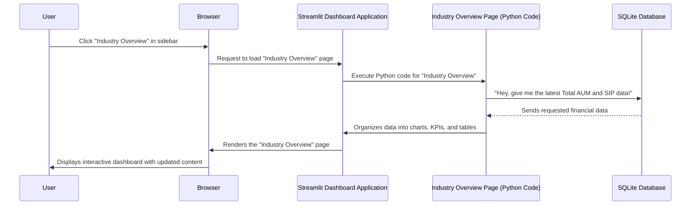
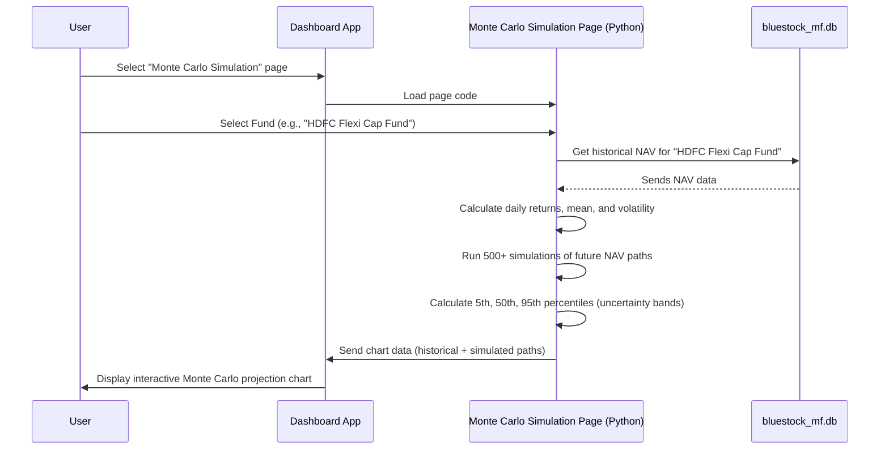
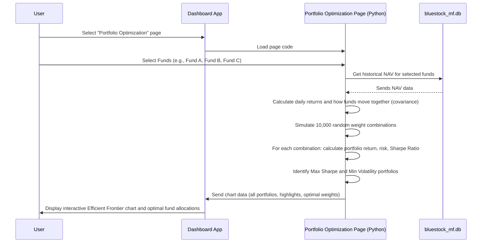

# Chapter 1: Streamlit Dashboard Application

Imagine you have a huge pile of mutual fund data – a mountain of numbers, names, and dates. How do you make sense of it all? How do you easily spot trends, compare different funds, or understand investor behavior without needing to write complex code every single time you have a question?

This is exactly the problem our **Streamlit Dashboard Application** solves! It's like having your own personal financial research assistant, always ready to show you valuable insights with just a few clicks. Think of it as a customizable control panel for your mutual fund data.

### What is a Streamlit Dashboard Application?

Let's break down this concept into simple pieces:

1.  **Streamlit: The Magic Tool**: Streamlit is a fantastic Python library that allows us to build interactive web applications (like our dashboard) using _just Python code_. You don't need to be a web development expert; if you can write Python, you can build a Streamlit app! It lets us "draw" charts, tables, and buttons directly with Python commands.

2.  **The Dashboard Application**: This refers to the entire interactive website you see. It's designed to be a "control panel" where users can explore mutual fund data, apply filters, and visualize trends without writing any code. It's the "user's window into the analytics."

3.  **Pages & Sidebar**: Just like a book has chapters, our dashboard has different "pages" for different topics. For example, one page might be for a general "Industry Overview," and another for "Fund Performance" of individual funds. You navigate between these pages using a menu, typically located on the left side of the dashboard – this is called the **sidebar**.

4.  **Charts, Tables, KPIs, and Filters (Widgets)**: These are the interactive elements you'll find on the pages.
    - **Charts** (like line graphs or bar charts) help visualize trends.
    - **Tables** display detailed data in an organized way.
    - **KPIs** (Key Performance Indicators) are those big, important numbers that highlight crucial metrics (e.g., "Total AUM").
    - **Filters** (like dropdown menus or checkboxes) let you customize what data you want to see. For example, you might filter funds by "Equity" category or by a specific "Fund House."

### How Do You Use It?

Using the Streamlit Dashboard Application is straightforward and doesn't require any coding from your side!

1.  **Start the Application**: Typically, you (or someone who set it up) would run a simple Python command in your terminal:

    ```bash
    streamlit run dashboard/app.py
    ```

    This command tells your computer to start the Streamlit application.

2.  **Open in Browser**: After running the command, a new tab will automatically open in your web browser, showing the dashboard's main welcome page.

3.  **Explore with the Sidebar**: On the left side of the dashboard, you'll see a sidebar menu. You can click on different page names, such as:
    - "Industry Overview" to see macro-level trends.
    - "Fund Performance" to deep-dive into specific funds.
    - "Investor Analytics" to understand transaction patterns.
    - And more!

4.  **Interact with Filters and Charts**: Once on a page, you can use the dropdowns, checkboxes, or sliders (our "filters") to narrow down the data you're interested in. The charts and tables will instantly update to reflect your selections, allowing you to explore the data dynamically.

### What Happens "Under the Hood" When You Click?

Let's imagine you click on the "Industry Overview" page in the sidebar. Here's a simplified sequence of events:



In essence:

1.  You (the **User**) click a page name.
2.  Your web browser tells the **Streamlit Dashboard Application** to load that specific page.
3.  The Python code for that page (like `1_Industry_Overview.py`) starts running.
4.  This code then asks our **SQLite Database** for the specific mutual fund data it needs (e.g., latest AUM, SIP inflows). We'll learn more about how we talk to the database in the [Database Query Helper](03_database_query_helper_.md) chapter and what data it holds in [Data Model / Database Schema](04_data_model___database_schema_.md).
5.  The database sends the data back.
6.  The Python code uses this data to create interactive charts (using libraries like `plotly`) and formats numbers for Key Performance Indicators (KPIs).
7.  Finally, Streamlit takes all these components and displays them beautifully in your **Browser** for you to see and interact with!

### A Peek at the Code

Let's look at some very simple code snippets to see how Streamlit works its magic.

**The Main Entry Point: `app.py`**

The `app.py` file (located in `dashboard/app.py`) is like the welcome mat to our application. When you run `streamlit run`, this is the first file Streamlit looks at.

```python
# File: dashboard\app.py
import streamlit as st # Import the Streamlit library
import os

# Configure how your web page looks
st.set_page_config(
    page_title="Bluestock MF Dashboard", # Title in browser tab
    page_icon="📈",                      # Icon in browser tab
    layout="wide",                       # Use the full width of the screen
    initial_sidebar_state="expanded"     # Keep the sidebar open by default
)

# ... (code to load and display a logo, not shown here to keep it simple) ...

# Display a main title and a welcome message
st.title("📈 Bluestock Mutual Fund Analytics")
st.markdown("""
Welcome to the interactive mutual fund dashboard!

This dashboard connects directly to the live SQLite database (`bluestock_mf.db`) to provide real-time analytics.
Please select a page from the sidebar menu to explore different analytics:

*   **1. Industry Overview:** Macro-level KPIs and AUM trends.
*   **2. Fund Performance:** Deep-dive into specific mutual funds and risk metrics.
*   # ... (other pages are listed here) ...
""")
```

- `import streamlit as st`: This line is essential! It imports the Streamlit library, allowing us to use its functions by typing `st.something()`.
- `st.set_page_config(...)`: This sets up basic properties for our web page, like the title you see in your browser tab (`page_title`), a little emoji icon (`page_icon`), and how wide the content can be (`layout="wide"`).
- `st.title(...)` and `st.markdown(...)`: These functions are how we place text on our dashboard. `st.title` makes large, bold text, and `st.markdown` lets us write text using Markdown formatting (like bullet points or bold words). This is what creates the friendly welcome message you see when you first open the app.

**Building a Page: `1_Industry_Overview.py`**

Each distinct "page" in our dashboard is a separate Python file, typically found inside the `dashboard/pages` folder. Let's look at `dashboard/pages/1_Industry_Overview.py` as an example to see how a page is constructed.

```python
# File: dashboard\pages\1_Industry_Overview.py
import streamlit as st # For dashboard elements
import pandas as pd    # For data manipulation
import sqlite3         # For connecting to the database
import plotly.express as px # For creating charts

st.set_page_config(page_title="Industry Overview", layout="wide")

# ... (logo loading code and database path setup) ...

@st.cache_data # This makes data loading super fast!
def load_data(query):
    """Executes a SQL query and returns a pandas DataFrame."""
    try:
        conn = sqlite3.connect(DB_PATH) # Connects to our SQLite database
        df = pd.read_sql(query, conn)  # Runs the SQL query and gets data
        conn.close()
        return df
    except Exception as e:
        st.error(f"Database error: {e}") # Shows an error if something goes wrong
        return pd.DataFrame()

st.title("🏢 Industry Overview")
st.markdown("Macro-level snapshot of the Indian Mutual Fund Industry.")

# --- 1. FETCH KPI DATA ---
# This is a SQL query to get the total Asset Under Management (AUM)
aum_query = """
SELECT SUM(aum_lakh_crore) as total_aum
FROM fact_aum
WHERE date = (SELECT MAX(date) FROM fact_aum)
"""
total_aum_df = load_data(aum_query) # Call our function to get data from the DB
total_aum = total_aum_df.iloc[0]['total_aum'] if not total_aum_df.empty else 0

# --- 2. RENDER KPI CARDS ---
col1, col2, col3, col4 = st.columns(4) # Create 4 columns to arrange content side-by-side
col1.metric("Total AUM", f"Rs. {total_aum:.2f}L Cr") # Display a big, bold metric
# ... (other metrics are displayed in col2, col3, col4) ...

st.markdown("---") # Draws a horizontal separator line

# --- 3. RENDER CHARTS ---
col_left, col_right = st.columns(2) # Create 2 columns for side-by-side charts

with col_left:
    st.subheader("Industry AUM Growth")
    aum_trend_query = "SELECT date, SUM(aum_lakh_crore) as total_aum FROM fact_aum GROUP BY date ORDER BY date"
    aum_trend_df = load_data(aum_trend_query)

    if not aum_trend_df.empty:
        fig_aum = px.line(aum_trend_df, x='date', y='total_aum', markers=True,
                          title="Total Industry AUM (Lakh Crore) - 2022 to 2025")
        st.plotly_chart(fig_aum, use_container_width=True) # Display the interactive line chart
    # ... (rest of the page logic and the second chart in col_right) ...
```

- `@st.cache_data`: This is a performance optimization. It tells Streamlit to remember the result of the `load_data` function. If you call `load_data` with the exact same query again, Streamlit will just give you the saved result instead of re-running the query, making your dashboard much faster!
- `load_data(query)`: This custom Python function is our crucial link to the database. It takes a SQL query (a command to ask the database for specific information), connects to our `bluestock_mf.db` database, runs the query, and brings the data back as a `pandas DataFrame` (a table-like structure in Python).
- `st.columns(...)`: This is a powerful layout tool. It allows us to arrange content (like our KPI cards or charts) next to each other, making the dashboard look neat and organized.
- `st.metric(...)`: This function is perfect for displaying Key Performance Indicators (KPIs) – those big, important numbers like "Total AUM."
- `plotly.express as px`: This library is used to create beautiful, interactive charts. `px.line` makes a line chart, and `px.bar` makes a bar chart.
- `st.plotly_chart(...)`: Once we create a chart using `plotly`, this function displays it on our Streamlit dashboard, making it interactive for users.

In essence, the Python code for each page retrieves data from the database, processes it (if needed), and then uses various Streamlit functions (`st.title`, `st.markdown`, `st.columns`, `st.metric`, `st.plotly_chart`) to build the visual and interactive elements of the dashboard.

### Conclusion

In this chapter, we learned that the **Streamlit Dashboard Application** is an interactive web interface that allows users to easily explore and visualize mutual fund data without writing any code. We understood how it's built with Python using the Streamlit library, how it uses different "pages" for various topics, and how it fetches data from a database to display charts, tables, and important numbers.

Next, we'll dive deeper into the core financial calculations and models that power some of these insights in our dashboard: the [Financial Simulation & Optimization Modules](02_financial_simulation___optimization_modules_.md).

---

# Chapter 2: Financial Simulation & Optimization Modules

In the previous chapter, [Streamlit Dashboard Application](01_streamlit_dashboard_application_.md), we learned how our dashboard provides a user-friendly window into mutual fund data, allowing you to see trends and numbers with just a few clicks. But what if you don't just want to see what _has happened_, but also want to understand what _could happen_ in the future, or how to make the _best decisions_ with your funds?

This is where our **Financial Simulation & Optimization Modules** come in! Think of them as the "brain" behind the dashboard that performs smart calculations. They don't just show you raw data; they help you forecast, strategize, and make smarter investment choices.

### What Problem Do These Modules Solve?

Imagine you're trying to build a portfolio of mutual funds. You have some historical data, but:

1.  **How do you predict how a fund might perform in the _future_?** The past is not always a perfect guide.
2.  **How do you choose a _combination_ of funds that gives you the best return without taking on too much risk?** Just picking the highest-return fund might also mean picking the riskiest one!
3.  **How do you get personalized fund suggestions based on _your_ comfort level with risk?**

These modules provide powerful, data-driven answers to these tough questions!

Let's break down these "smart calculations" into three key concepts:

1.  **Monte Carlo Simulation:** For forecasting future fund values.
2.  **Markowitz Portfolio Optimization:** For finding the best combination of funds.
3.  **Fund Recommender:** For suggesting funds based on your risk appetite.

---

### 1. Monte Carlo Simulation: Predicting the Future with "What If" Scenarios

Have you ever wondered, "What if the market does really well?" or "What if it has a rough patch?" The Monte Carlo Simulation helps answer these "what if" questions for your mutual fund's Net Asset Value (NAV) by simulating thousands of possible futures.

**Analogy:** Imagine you're rolling a special, weighted dice that represents a fund's daily performance. Instead of rolling it once, you roll it 1,000 times, then 1,000 more times, each time recording the outcome for many days into the future. By looking at all these thousands of simulated paths, you can get a good idea of the best, worst, and most likely scenarios.

**What it does:**
It forecasts a fund's future value (NAV) by:

- Looking at its past daily ups and downs (historical volatility).
- Randomly generating thousands of possible future daily ups and downs based on those historical patterns.
- Creating thousands of potential "paths" the fund's NAV could take over a period (e.g., 5 years).
- Showing you the range of potential outcomes, from the optimistic ("best case") to the pessimistic ("worst case"), and the most probable ("expected").

#### How to Use It (on the Dashboard):

On the Streamlit dashboard, you'd simply navigate to the "Monte Carlo Simulation" page. You'd then select a mutual fund from a dropdown menu. The dashboard would then display a chart showing its historical NAV and the projected future NAV with "uncertainty bands" for the best, worst, and expected outcomes.



#### Under the Hood: The Simulation Steps

The Monte Carlo simulation page (`dashboard\pages\5_Monte_Carlo_Simulation.py`) performs these steps:

1.  **Get Historical Data:** It first fetches all past daily NAVs for your chosen fund from our [Data Model / Database Schema](04_data_model___database_schema_.md) using the [Database Query Helper](03_database_query_helper_.md).

    ```python
    # From dashboard\pages\5_Monte_Carlo_Simulation.py
    # Fetch historical NAV for the selected fund
    nav_query = f"SELECT date, nav FROM fact_nav WHERE amfi_code = '{amfi_code}' ORDER BY date ASC"
    nav_df = load_data(nav_query) # load_data talks to the database
    ```

    _Explanation:_ This code queries our database to get the `date` and `nav` (Net Asset Value) for the fund you selected. The `load_data` function (which we saw in Chapter 1) handles the actual database connection.

2.  **Calculate Key Statistics:** From these historical NAVs, it calculates the average daily return (`mu`) and how much the daily returns typically spread out (`sigma`, also known as volatility).

    ```python
    # From dashboard\pages\5_Monte_Carlo_Simulation.py
    nav_df['daily_return'] = nav_df['nav'].pct_change().clip(lower=-0.03, upper=0.03)
    mu = nav_df['daily_return'].mean()   # Average daily return
    sigma = nav_df['daily_return'].std() # Daily volatility (risk)
    ```

    _Explanation:_ We calculate the percentage change day-over-day to get daily returns. We also "clip" them to make sure extreme, unrealistic jumps in data don't mess up our simulation. `mu` gives us the average tiny step the fund takes each day, and `sigma` tells us how big those steps usually are.

3.  **Run Thousands of Simulations:** Using `mu` and `sigma`, the module then simulates daily returns for many future days, repeated for hundreds or thousands of "parallel universes" (simulations). Each new day's NAV is calculated from the previous day's NAV and a randomly generated daily return.

    ```python
    # From dashboard\pages\5_Monte_Carlo_Simulation.py (simplified)
    NUM_SIMULATIONS = 500
    TIME_HORIZON = 5 * 252 # 5 years of trading days

    # Generate random daily returns for all simulations
    simulated_daily_returns = np.random.normal(mu, sigma, (TIME_HORIZON, NUM_SIMULATIONS))

    # Calculate price paths for all simulations
    price_paths = np.zeros_like(simulated_daily_returns)
    price_paths[0] = latest_nav * (1 + simulated_daily_returns[0]) # First day
    for t in range(1, TIME_HORIZON):
        price_paths[t] = price_paths[t-1] * (1 + simulated_daily_returns[t])
    ```

    _Explanation:_ `np.random.normal` generates random numbers (representing daily returns) that follow the historical pattern (mean `mu`, standard deviation `sigma`). We then step through each day, multiplying the previous day's NAV by `(1 + random_daily_return)` to get the new NAV, repeating this for all 500 simulations.

4.  **Visualize Uncertainty:** Finally, it takes all these simulated paths and calculates "percentiles" for each future date. The 5th percentile shows the "worst case" (only 5% of simulations were worse), the 50th percentile shows the "expected case" (median), and the 95th percentile shows the "best case." These are plotted on the dashboard.

    ```python
    # From dashboard\pages\5_Monte_Carlo_Simulation.py (simplified)
    p5 = np.percentile(price_paths, 5, axis=1)   # 5th percentile (Worst Case)
    p50 = np.percentile(price_paths, 50, axis=1) # 50th percentile (Median/Expected)
    p95 = np.percentile(price_paths, 95, axis=1) # 95th percentile (Best Case)

    # Use plotly to plot fig.add_trace for historical, p5, p50, p95
    # st.plotly_chart(fig, use_container_width=True)
    ```

    _Explanation:_ We use `np.percentile` to find these key levels across all the simulated paths for each future day. Then, the `plotly` library (which we briefly saw in Chapter 1) is used to draw the beautiful, interactive chart on the dashboard.

---

### 2. Markowitz Portfolio Optimization: Finding the "Efficient Frontier"

Choosing just one fund is hard enough, but choosing a _mix_ of funds is even harder! How do you combine them so that you get the highest possible return without taking on unnecessary risk? This is what Markowitz Portfolio Optimization helps you with.

**Analogy:** Imagine you're a chef trying to make the tastiest, healthiest meal possible with a limited set of ingredients. Each ingredient (fund) has a certain flavor (return) and some might be a bit risky (volatility). Some ingredients might also work really well together, enhancing each other, while others might clash. The Markowitz algorithm helps you find the _perfect recipe_ (portfolio weights) that gives you the best "taste-to-health" ratio (return-to-risk ratio).

**What it does:**

- Allows you to select several mutual funds.
- Calculates their historical returns and, importantly, how their prices move _together_ (this is called covariance).
- Simulates thousands of different ways to combine these funds (e.g., 20% in Fund A, 30% in Fund B, 50% in Fund C, or 10% in A, 80% in B, 10% in C, etc.).
- For each combination, it calculates the portfolio's overall expected return and its overall risk (volatility).
- It then plots these combinations on a graph, showing you the "Efficient Frontier" – a line representing the portfolios that give the maximum possible return for each level of risk. You can then pick a portfolio on this line that matches your risk comfort. The "Maximum Sharpe Ratio" portfolio is often highlighted as the "best" mathematically, as it offers the highest return per unit of risk.

#### How to Use It (on the Dashboard):

On the Streamlit dashboard, you would go to the "Portfolio Optimization" page. You'd use a multi-select box to choose, say, 2 to 5 mutual funds. The dashboard would then display a scatter plot showing thousands of possible portfolio combinations (the "Efficient Frontier") and highlight the two most important: the one with the highest "Sharpe Ratio" (best return for risk) and the one with the "Minimum Volatility" (least risky). It also shows you the optimal percentage allocation for each fund in the "best" portfolio.



#### Under the Hood: Optimizing Your Portfolio

The Portfolio Optimization page (`dashboard\pages\6_Portfolio_Optimization.py`) handles this process:

1.  **Fetch and Prepare Data:** It gets historical NAV data for all selected funds and converts it into daily returns. Importantly, it needs to understand how funds move _together_ using a "covariance matrix."

    ```python
    # From dashboard\pages\6_Portfolio_Optimization.py (simplified)
    # Get NAV for selected funds
    raw_df = pd.read_sql(query, conn, params=selected_amfi_codes)
    nav_pivot = raw_df.pivot(index='date', columns='amfi_code', values='nav')
    nav_pivot = nav_pivot.resample('B').ffill().dropna() # Align dates
    returns_df = nav_pivot.pct_change().dropna() # Daily returns

    # Calculate Annualized Returns and Covariance Matrix
    TRADING_DAYS = 252
    mean_returns = returns_df.mean() * TRADING_DAYS
    cov_matrix = returns_df.cov() * TRADING_DAYS
    ```

    _Explanation:_ We fetch NAVs for all chosen funds, make sure their dates align, and calculate their daily returns. `mean_returns` gives the average return for each fund, and `cov_matrix` shows how much their returns move in sync (or opposite directions). This `cov_matrix` is crucial for understanding portfolio risk.

2.  **Run Portfolio Simulations:** It then creates thousands of random ways to split your investment across the chosen funds (these are called "weights"). For each combination, it calculates the overall portfolio's expected return and its overall risk (volatility) using advanced math involving `mean_returns` and `cov_matrix`.

    ```python
    # From dashboard\pages\6_Portfolio_Optimization.py (simplified)
    NUM_PORTFOLIOS = 10000
    num_funds = len(selected_funds)

    # Generate random weights for each fund (summing to 1 for each portfolio)
    weights = np.random.dirichlet(np.ones(num_funds), size=NUM_PORTFOLIOS)

    # Calculate portfolio returns and volatility for each simulated portfolio
    port_returns = np.dot(weights, mean_returns)
    port_volatility = np.zeros(NUM_PORTFOLIOS)
    for i in range(NUM_PORTFOLIOS):
        port_volatility[i] = np.sqrt(np.dot(weights[i].T, np.dot(cov_matrix, weights[i])))

    # Calculate Sharpe Ratio (Return / Risk)
    sharpe_ratios = (port_returns - RISK_FREE_RATE) / port_volatility
    ```

    _Explanation:_ `np.random.dirichlet` creates sets of weights (percentages) for our funds that always add up to 100%. Then, for each of the 10,000 simulated portfolios, we calculate its total expected return and total risk using the `weights`, `mean_returns`, and `cov_matrix`. The Sharpe Ratio tells us how good the return is _compared to_ the risk taken.

3.  **Identify Optimal Portfolios and Visualize:** The results (returns, risks, and Sharpe Ratios for all 10,000 portfolios) are then plotted on a graph, creating the "Efficient Frontier." The algorithm identifies the portfolio with the highest Sharpe Ratio (best risk-adjusted return) and the one with the lowest volatility (least risk) and highlights them.

    ```python
    # From dashboard\pages\6_Portfolio_Optimization.py (simplified)
    # Find the portfolio with the highest Sharpe Ratio and lowest Volatility
    max_sharpe_idx = port_results['Sharpe'].idxmax()
    min_vol_idx = port_results['Volatility'].idxmin()

    # Use plotly to plot the scatter plot of all portfolios, plus highlights
    # fig.add_trace(go.Scatter(...))
    # st.plotly_chart(fig, use_container_width=True)
    ```

    _Explanation:_ `idxmax()` and `idxmin()` quickly find the "best" portfolios from our simulated results. `plotly` then helps us draw the graph and mark these important points clearly for the user.

---

### 3. Fund Recommender: Personalized Fund Suggestions

If you're unsure which fund categories to even begin with, a fund recommender can be super helpful. It acts like a quick filter, suggesting funds that align with your general comfort level for risk.

**Analogy:** Imagine asking a store clerk, "I like adventure novels, what do you suggest?" The clerk doesn't need to know every single book you've read, just your preference (adventure), and they'll suggest some top-rated adventure books.

**What it does:**

- You tell it your general **risk appetite** (e.g., "Low," "Moderate," or "High").
- It looks through all available funds.
- It filters them based on their inherent risk level and then sorts them by a performance metric like the **Sharpe Ratio** (which we just discussed – higher is better).
- It suggests a few top funds that match your criteria.

#### How to Use It (Behind the Scenes / Could be a Dashboard Feature):

While not explicitly a separate page on the current dashboard, this module exists as a Python script (`scripts\recommender.py`) that could power a recommendation feature. You'd typically run this script (or it could be triggered by a button on a dashboard page) and input your risk preference.

```bash
python scripts/recommender.py
```

This script would then print out a table of recommended funds in your terminal.

#### Under the Hood: The Recommendation Logic

The fund recommender script (`scripts\recommender.py`) follows these steps:

1.  **Load Fund Data:** It loads a list of all mutual funds and their associated metrics, including a calculated Sharpe Ratio (which we covered in Portfolio Optimization!) and their risk grades.

    ```python
    # From scripts\recommender.py
    funds = pd.read_csv(data_dir / 'clean_fund_master.csv')
    sharpe = pd.read_csv(data_dir / 'sharpe_values.csv')
    df = pd.merge(funds, sharpe, on='amfi_code')
    ```

    _Explanation:_ It reads two CSV files. `clean_fund_master.csv` has basic fund details, and `sharpe_values.csv` contains the calculated Sharpe Ratios for each fund. These are joined together using the `amfi_code` (a unique fund identifier).

2.  **Determine Fund Risk:** It determines the risk level for each fund. This could be from a predefined `risk_grade` column in our database, or it can be _mapped_ based on the fund's `category` (e.g., Debt funds are generally 'Low' risk, Small Cap Equity funds are 'High' risk).

    ```python
    # From scripts\recommender.py (simplified)
    # Fallback mapping based on Category and Sub-category if no explicit risk_grade
    def map_risk(row):
        cat = str(row['category']).lower()
        if 'debt' in cat: return 'Low'
        elif 'equity' in cat:
            if 'large' in str(row['sub_category']).lower(): return 'Moderate'
            else: return 'High'
        return 'Moderate'
    df['mapped_risk'] = df.apply(map_risk, axis=1)
    risk_col = 'mapped_risk'
    ```

    _Explanation:_ This function `map_risk` assigns a "Low," "Moderate," or "High" risk label to each fund based on its type if a specific risk column isn't present in the data.

3.  **Filter and Sort:** It filters the entire list of funds to only include those matching your chosen risk appetite. Then, it sorts these matching funds by their Sharpe Ratio, placing the best performing (risk-adjusted) funds at the top.

    ```python
    # From scripts\recommender.py
    target_risk = risk_appetite.lower() # 'low', 'moderate', or 'high'
    filtered_df = df[df[risk_col].str.lower().str.contains(target_risk, na=False)]

    # Sort by Sharpe Ratio (highest is best) and pick top 3
    top_3 = filtered_df.sort_values(by=sharpe_col, ascending=False).head(3)
    ```

    _Explanation:_ `str.contains(target_risk)` helps find funds whose risk description matches (e.g., "Low to Moderate" for a "Low" search). Then, `sort_values` puts the funds with the highest `sharpe_col` at the top, and `.head(3)` selects the top three.

4.  **Display Recommendations:** Finally, it presents these top funds to you in an easy-to-read format.

    ```python
    # From scripts\recommender.py
    print(f"\n--- TOP 3 RECOMMENDED FUNDS ({risk_appetite.upper()} RISK) ---")
    output = top_3[['scheme_name', 'category', sharpe_col]].copy()
    output.rename(columns={'scheme_name': 'Fund Name', sharpe_col: 'Sharpe Ratio'}, inplace=True)
    print(output.to_string())
    ```

    _Explanation:_ This code simply formats the selected top funds and their details (like name, category, and Sharpe Ratio) into a clean table for display.

---

### Conclusion

In this chapter, we explored the powerful **Financial Simulation & Optimization Modules**. We learned how the **Monte Carlo Simulation** helps us forecast future fund values by running thousands of "what if" scenarios, how **Markowitz Portfolio Optimization** helps us find the "efficient frontier" – the best combination of funds for optimal risk-adjusted returns – and how a **Fund Recommender** can suggest suitable funds based on your risk appetite.

---
