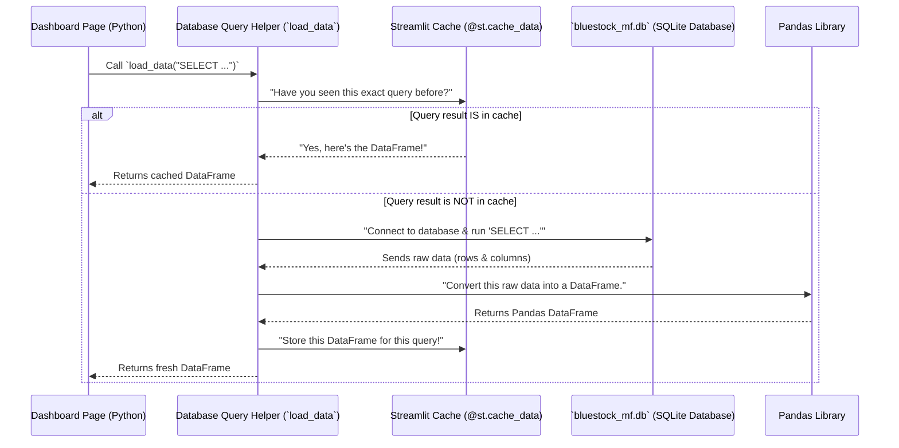
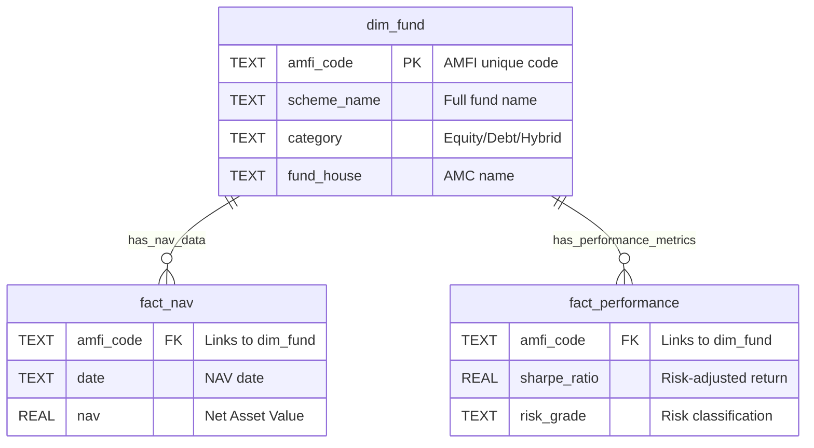

# Chapter 3: Database Query Helper

In the last chapter, [Financial Simulation & Optimization Modules](02_financial_simulation___optimization_modules_.md), we saw how our dashboard can perform complex calculations like forecasting future NAVs and optimizing portfolios. But for all these powerful features and the beautiful charts we discussed in [Streamlit Dashboard Application](01_streamlit_dashboard_application_.md), there's one fundamental question: **Where does all the data come from?**

Imagine you have a giant filing cabinet filled with all the mutual fund information – historical prices, fund details, transaction records, and more. How do your dashboard pages reliably, quickly, and safely get the specific pieces of information they need from this filing cabinet? This is exactly the problem our **Database Query Helper** solves!

### What is the Database Query Helper?

The Database Query Helper is a special, reusable Python function named `load_data` that acts as the trusted messenger between our dashboard application and our central SQLite database. It's like having a dedicated librarian who knows exactly how to find the right book (data), present it neatly, and even remember frequently asked for information to save time.

Every time a dashboard page needs data – whether it's for displaying current AUM, plotting a fund's historical NAV, or running a simulation – it asks `load_data` to fetch it.

Let's break down its superpowers:

1.  **Secure Connection:** It knows how to connect to our SQLite database (`bluestock_mf.db`) safely.
2.  **Execute Queries:** You tell it _what_ data you want by giving it a special request called an **SQL Query**. It takes this request and runs it against the database.
3.  **Data Conversion:** The database usually sends raw data. `load_data` efficiently converts this raw data into a friendly **Pandas DataFrame** – which is like a neat table in Python, super easy for us to work with.
4.  **Close Connection:** Once it gets the data, it politely closes the connection to the database, ensuring everything is tidy and secure.
5.  **Smart Memory (Caching):** This is where the `@st.cache_data` magic comes in! If you ask for the _exact same data_ again, `load_data` remembers the answer from last time and gives it to you instantly, without bothering the database again. This makes our dashboard super fast!

### How to Use the Database Query Helper

You've actually already seen `load_data` in action in Chapter 1 when we looked at the `1_Industry_Overview.py` page! It's used to fetch all the Key Performance Indicators (KPIs) and chart data.

Let's revisit a simple example: getting the total Asset Under Management (AUM) for the industry.

**Your Goal:** Display the latest total AUM on the "Industry Overview" page.

**The Request (SQL Query):**
To get this data from our database, you'd write an SQL query like this:

```sql
SELECT SUM(aum_lakh_crore) as total_aum
FROM fact_aum
WHERE date = (SELECT MAX(date) FROM fact_aum)
```

- **`SELECT SUM(aum_lakh_crore) as total_aum`**: This part says, "Add up all the numbers in the `aum_lakh_crore` column and call the result `total_aum`."
- **`FROM fact_aum`**: This tells the database to look in the `fact_aum` table (which holds AUM data).
- **`WHERE date = (SELECT MAX(date) FROM fact_aum)`**: This is a filter! It makes sure we only get the AUM for the _most recent date_ available in the table.

**Using `load_data` in your Python code:**

Now, to get this data using our helper function, you just pass your SQL query string to `load_data`:

```python
# From dashboard\pages\1_Industry_Overview.py (simplified)

# The SQL query we want to run
aum_query = """
SELECT SUM(aum_lakh_crore) as total_aum
FROM fact_aum
WHERE date = (SELECT MAX(date) FROM fact_aum)
"""

# Call our helper function to get the data
total_aum_df = load_data(aum_query)

# Now, total_aum_df is a Pandas DataFrame with our AUM data!
# You can then extract the value:
total_aum = total_aum_df.iloc[0]['total_aum'] if not total_aum_df.empty else 0

st.metric("Total AUM", f"Rs. {total_aum:.2f}L Cr") # Display on dashboard
```

- `aum_query`: This is just a Python variable holding our SQL query as a string.
- `total_aum_df = load_data(aum_query)`: This is the magic line! We call `load_data` and give it our `aum_query`. It goes to the database, runs the query, and returns the result as a `Pandas DataFrame`.
- `total_aum = ...`: We then access the actual number from the DataFrame. `total_aum_df.iloc[0]['total_aum']` means "take the first row (`iloc[0]`) and the column named `total_aum`."

The output `total_aum_df` would look something like this (conceptually, if printed):

```
   total_aum
0      81.25
```

It's a simple table (DataFrame) with one row and one column, holding the total AUM value. This table format is very easy for Python to process and display!

### What Happens "Under the Hood" When `load_data` is Called?

Let's trace the steps when a dashboard page asks `load_data` for information:



Here's a closer look at the actual Python code inside our `load_data` function (found in various `dashboard/pages/*.py` files, like `dashboard\pages\1_Industry_Overview.py`):

```python
# File: dashboard\pages\1_Industry_Overview.py (simplified)
import streamlit as st # For @st.cache_data and displaying errors
import pandas as pd    # For handling DataFrames
import sqlite3         # For connecting to SQLite

# This is the path to our database file
DB_PATH = os.path.abspath(os.path.join(os.path.dirname(__file__), '..', '..', 'data', 'db', 'bluestock_mf.db'))

@st.cache_data # This is the "smart memory" decorator!
def load_data(query):
    """Executes a SQL query and returns a pandas DataFrame."""
    try:
        # Step 1: Connect to the database
        conn = sqlite3.connect(DB_PATH)

        # Step 2: Run the SQL query and get data into a DataFrame
        df = pd.read_sql(query, conn)

        # Step 3: Close the database connection
        conn.close()

        # Step 4: Return the DataFrame
        return df
    except Exception as e:
        # If something goes wrong, show an error message
        st.error(f"Database error: {e}")
        return pd.DataFrame() # Return an empty DataFrame to avoid crashes
```

Let's break down the key parts of this code:

- **`DB_PATH = ...`**: This line figures out the exact location of our SQLite database file (`bluestock_mf.db`). This database holds all the mutual fund data we've collected. We'll learn more about what's inside it in the [Data Model / Database Schema](04_data_model___database_schema_.md) chapter.
- **`@st.cache_data`**: This is a special instruction from the Streamlit library. It tells Python, "Hey, remember the results of this `load_data` function! If it's called again with the _exact same inputs_ (the `query` string), don't run the code inside; just give back the saved result." This is a huge performance booster for our dashboard.
- **`conn = sqlite3.connect(DB_PATH)`**: This line establishes the connection to our SQLite database. Think of it as opening the filing cabinet.
- **`df = pd.read_sql(query, conn)`**: This is a powerful function from the Pandas library. It takes your `query` (the SQL request) and the `conn` (the open database connection), sends the query to the database, waits for the results, and then immediately converts those results into a `pandas DataFrame`. This is how we get our neat data table!
- **`conn.close()`**: After fetching the data, it's good practice to close the database connection. This frees up resources and keeps our database secure.
- **`try...except`**: This block is for error handling. If there's any problem connecting to the database or running the query, it catches the error and displays a friendly message on the dashboard instead of crashing the entire application.

In essence, `load_data` is a robust and efficient wrapper that handles all the technical details of talking to a database, allowing our dashboard pages to simply _ask_ for the data they need without worrying about the underlying complexities.

### Conclusion

In this chapter, we uncovered the vital role of the **Database Query Helper**, specifically our `load_data` function. We learned that it's the core component responsible for securely connecting to our SQLite database, executing specific SQL queries to fetch data, efficiently converting that data into user-friendly Pandas DataFrames, and closing connections. We also understood the importance of the `@st.cache_data` decorator, which acts as a smart memory to significantly speed up our dashboard.

This helper function ensures that all the data shown on our Streamlit dashboard, whether it's for simple KPIs or complex simulations, is retrieved reliably and quickly. But what exactly _is_ in this database? In our next chapter, we'll dive into the [Data Model / Database Schema](04_data_model___database_schema_.md) to understand the structure and content of our mutual fund data.

---

# Chapter 4: Data Model / Database Schema

In our last chapter, [Database Query Helper](03_database_query_helper_.md), we learned about `load_data` – our trusty librarian for fetching information from the database using special requests called SQL queries. But how does this librarian know where to find the books, what sections they belong to, or how different books relate to each other?

This is where the **Data Model / Database Schema** comes in! It's the master plan, the blueprint, or the complete catalog system of our entire mutual fund analytics database.

### What Problem Does the Data Model Solve?

Imagine our mutual fund database is like a gigantic, super-organized library. Without a catalog, finding a specific fund's daily price, its category, or even knowing what kind of information is available would be a nightmare. You'd be blindly searching through piles of data!

The **Data Model / Database Schema** is exactly that catalog system. It defines:

- **What information is stored**: Do we store daily prices? Fund manager names? Investor ages? Yes!
- **How data is organized**: Is it all in one giant list, or neatly divided into different sections? Neatly divided!
- **How different pieces of information are related**: How do we know which daily price belongs to which fund? Through relationships!

By understanding our database's schema, anyone (or any program, like our Streamlit dashboard) can easily understand what data is available, where to find it, and how to combine different pieces of information to get valuable insights.

### Key Concepts of Our Data Model

Let's break down the main ideas that make up our database's "catalog":

#### 1. Tables: The Sections of Our Library

Think of our database as a library, and **tables** are like the different well-defined sections or shelves. Each table holds a specific type of information.

For example:

- `dim_fund`: This table is like the "Fund Details" section. It holds descriptive information about each mutual fund, such as its name, the fund house it belongs to, its category (Equity, Debt), and launch date.
- `fact_nav`: This table is the "Daily Prices" section. It stores the Net Asset Value (NAV) for each fund on different dates.

#### 2. Columns: The Specific Details in Each Section

Inside each table (or section), you have **columns**. These are like the specific fields or details you'd find on a library card or in a book's entry.

For example, in the `dim_fund` table, you might find columns like:

- `scheme_name`: The full name of the mutual fund.
- `category`: Whether it's an Equity, Debt, or Hybrid fund.
- `fund_house`: The company managing the fund (e.g., SBI Mutual Fund).

And in the `fact_nav` table:

- `date`: The specific day the NAV was recorded.
- `nav`: The actual Net Asset Value (price) on that date.

#### 3. Keys: Linking Information Together

This is crucial! How do we know that a specific NAV from `fact_nav` belongs to "HDFC Flexi Cap Fund" from `dim_fund`? We use special identifiers called **keys**.

- **Primary Key (PK)**: This is a unique identifier for each "item" (row) in a table. Think of it like a book's ISBN. In our `dim_fund` table, `amfi_code` is the Primary Key. Every fund has a unique `amfi_code`.
- **Foreign Key (FK)**: This is a column in one table that refers to the Primary Key in _another_ table. It's how we link information across different sections. In our `fact_nav` table, `amfi_code` is a Foreign Key. It tells us which fund a particular NAV record belongs to by matching it back to the `amfi_code` in the `dim_fund` table.

#### 4. Dimension Tables (`dim_` prefix) vs. Fact Tables (`fact_` prefix)

Our database uses a common and very efficient way to organize data called a "Star Schema." This helps us store data neatly and retrieve it quickly for analysis.

- **Dimension Tables (often prefixed `dim_`)**: These tables hold descriptive attributes. They answer "who, what, where, when, why."
  - Example: `dim_fund` (What fund is it? What category? Who is the fund manager?). This information doesn't change daily.
- **Fact Tables (often prefixed `fact_`)**: These tables hold the quantitative, measurable data points – the numbers that change frequently and that we want to analyze. They also contain foreign keys that link back to dimension tables.
  - Example: `fact_nav` (What was the daily NAV?), `fact_transactions` (How much was invested?).

Here's a simplified visual of how some of our tables are organized and linked:



This diagram shows that `dim_fund` is our central "dimension" about funds. Both `fact_nav` and `fact_performance` have an `amfi_code` that connects back to `dim_fund`, allowing us to find a fund's descriptive details (like `scheme_name`) when we're looking at its daily NAV or performance metrics.

### Our Database's Catalog: `data_dictionary.md`

You don't have to guess what tables and columns exist! We have a special document, `data_dictionary.md`, that explicitly lists every table, its columns, data types, and a clear description. This is our official **Database Schema documentation**.

Let's look at a snippet from this file, focusing on `dim_fund` and `fact_nav`:

```markdown
# Data Dictionary: Bluestock Mutual Fund Analytics Database

## 1. dim_fund (Dimension Table)

Stores static master data about each mutual fund scheme.

| Column Name   | Data Type | Description                           |
| :------------ | :-------- | :------------------------------------ |
| `amfi_code`   | TEXT (PK) | AMFI unique scheme code (e.g. 125497) |
| `fund_house`  | TEXT      | AMC name (e.g. SBI Mutual Fund)       |
| `scheme_name` | TEXT      | Full official AMFI scheme name        |
| `category`    | TEXT      | Equity / Debt / Hybrid                |

| ... (other columns) ...

## 2. fact_nav (Fact Table)

Stores daily historical NAV data for the schemes.

| Column Name | Data Type | Description                                        |
| :---------- | :-------- | :------------------------------------------------- |
| `amfi_code` | TEXT (FK) | Foreign key mapping to dim_fund                    |
| `date`      | TEXT      | NAV date (business days + forward-filled weekends) |
| `nav`       | REAL      | Net Asset Value in INR                             |

| ... (other columns) ...
```

This `data_dictionary.md` is incredibly helpful! It tells you exactly what tables (`dim_fund`, `fact_nav`), columns (`amfi_code`, `scheme_name`, `nav`), and relationships (`amfi_code` is a PK in `dim_fund` and FK in `fact_nav`) exist.

### How to Use the Data Model to Get Information

Let's revisit our goal: **"I want to see the daily NAV for 'HDFC Flexi Cap Fund' along with its category ('Equity')."**

Using our understanding of the Data Model and the `data_dictionary.md`, here's how we'd approach this, just like our dashboard pages do:

1.  **Identify where the information lives:**
    - "HDFC Flexi Cap Fund" and its "category" (`Equity`) are descriptive details, so they are in the `dim_fund` table. We'll look for `scheme_name` and `category` columns.
    - "Daily NAV" is a measurable data point, so it's in the `fact_nav` table. We'll look for `date` and `nav` columns.

2.  **Identify how to link them:** Both tables have `amfi_code`. This is our common "key" to connect fund details with its daily prices.

3.  **Construct an SQL Query:** We'll ask our [Database Query Helper](03_database_query_helper_.md) (the `load_data` function) for this.

    First, let's get just the fund details:

    ```sql
    -- Query 1: Get fund details from dim_fund
    SELECT
        scheme_name,
        category,
        fund_house
    FROM
        dim_fund
    WHERE
        scheme_name = 'HDFC Flexi Cap Fund';
    ```

    **Output (conceptually, if using `load_data`):**
    A Pandas DataFrame like this:

    ```
             scheme_name    category        fund_house
    0  HDFC Flexi Cap Fund      Equity  HDFC Mutual Fund
    ```

    This shows us the category is 'Equity' and the fund house is 'HDFC Mutual Fund'. We also get the fund's `amfi_code` from this table if we included it in the `SELECT` statement (e.g., `SELECT amfi_code, scheme_name, ...`). Let's assume the `amfi_code` for HDFC Flexi Cap Fund is '125497'.

    Next, let's get the latest NAV for that specific fund using its `amfi_code`:

    ```sql
    -- Query 2: Get NAV for a specific fund from fact_nav
    SELECT
        date,
        nav
    FROM
        fact_nav
    WHERE
        amfi_code = '125497' -- Using the fund's unique AMFI code
    ORDER BY
        date DESC
    LIMIT 3; -- Just the 3 most recent NAVs
    ```

    **Output (conceptually):**
    A Pandas DataFrame like this:

    ```
             date      nav
    0  2023-10-26  123.45
    1  2023-10-25  123.10
    2  2023-10-24  122.95
    ```

    As you can see, by understanding the tables and their columns (from our `data_dictionary.md`), we can construct specific SQL queries to pull out exactly the information we need. The **Data Model** is the map that makes this navigation possible!

### Under the Hood: The Schema in Action

When our Streamlit dashboard page wants to display "Industry Overview" or "Fund Performance," its Python code uses our `load_data` helper (from [Database Query Helper](03_database_query_helper_.md)). The `load_data` function receives an SQL query string that is carefully crafted based on our understanding of the **Data Model**.

Here's a simplified sequence of how the dashboard uses the Data Model:

```mermaid
sequenceDiagram
    participant DashboardPage as Dashboard Page
    participant QueryWriter as Python Code (using Data Model knowledge)
    participant DataDict as data_dictionary.md
    participant QueryHelper as load_data() (from Ch 3)
    participant SQLiteDB as bluestock_mf.db

    DashboardPage->>QueryWriter: "I need HDFC Flexi Cap Fund's category and latest NAV."
    QueryWriter->>DataDict: "Which tables have fund names, categories, and NAVs? How are they linked?"
    DataDict-->>QueryWriter: "dim_fund has `scheme_name`, `category`. fact_nav has `date`, `nav`. Both link via `amfi_code`."
    QueryWriter->>QueryHelper: Call `load_data("SELECT df.scheme_name, df.category, fn.date, fn.nav FROM dim_fund df JOIN fact_nav fn ON df.amfi_code = fn.amfi_code WHERE df.scheme_name = 'HDFC Flexi Cap Fund' ORDER BY fn.date DESC LIMIT 1;")`
    QueryHelper->>SQLiteDB: Executes the SQL query based on table & column names.
    SQLiteDB-->>QueryHelper: Sends back matching rows from dim_fund and fact_nav.
    QueryHelper-->>DashboardPage: Returns a Pandas DataFrame with the combined fund category and NAV.
    DashboardPage->>DashboardPage: Displays "HDFC Flexi Cap Fund (Equity): Latest NAV 123.45"
```

In this diagram, the **Data Model** (represented by `data_dictionary.md`) is what the "Python Code" (QueryWriter) consults to know _how to formulate_ the correct SQL query. It tells us the names of the tables (`dim_fund`, `fact_nav`), their columns (`scheme_name`, `category`, `nav`), and the `amfi_code` key that links them together.

Without this well-defined schema, writing correct queries and consistently getting the right data would be impossible!

### Conclusion

In this chapter, we explored the crucial concept of the **Data Model / Database Schema**. We learned that it's the blueprint that defines the structure of our mutual fund analytics database, detailing what information is stored, how it's organized into **tables** (like `dim_fund` and `fact_nav`), what **columns** (specific details) each table contains, and how **keys** (like `amfi_code`) link related data across tables. We also understood the difference between descriptive **dimension tables** and quantitative **fact tables**.

This understanding is fundamental, as it allows all our dashboard components and simulation modules to intelligently request and retrieve the precise data they need. But where does all this organized data come from in the first place? In our next chapter, we'll discover the [ETL Pipeline (Extract, Transform, Load)](05_etl_pipeline__extract__transform__load__.md), which is responsible for gathering, cleaning, and loading all this raw financial data into our beautifully structured database.

---
